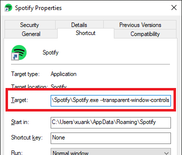

# SpotifyNoControl

Hides Spotify window control buttons.

## Usage

Windows user, please edit your Spotify shortcut and add flag `--transparent-window-controls` after the Spotify.exe:

Alternatively, you can use `SpotifyNoControl.exe`, included in this folder, to completely remove all windows controls and title menu (three dot at top left corner). Title menu still can be access via Alt key. Closing, minimizing can be done via right click menu at top window region.\
`SpotifyNoControl.exe` could be used as Spotify launcher, it opens Spotify and hides controls right after. You can drag and drop it to your taskbar but make sure you unpin the original Spotify icon first. Alternatively you can make a shortcut for it and add to desktop or start menu.\
Moreover, by default, Spotify adjusted sidebar items and profile menu icon to stay out of Windows native controls region. If you decided to use `SpotifyNoControl.exe` from now on, please open `user.css` file and change variable `--os-windows-icon-dodge` value to 0 as instruction to snap icons back to their original position.

## Alternatives

If the executable does not work for you, try using 

- [AHK implementation](https://github.com/SaifAqqad/AHK_SpotifyNoControl)
- [julienmaille's implementation](https://github.com/spicetify/spicetify-themes/raw/legacy/Dribbblish/SpotifyNoControl.exe)
