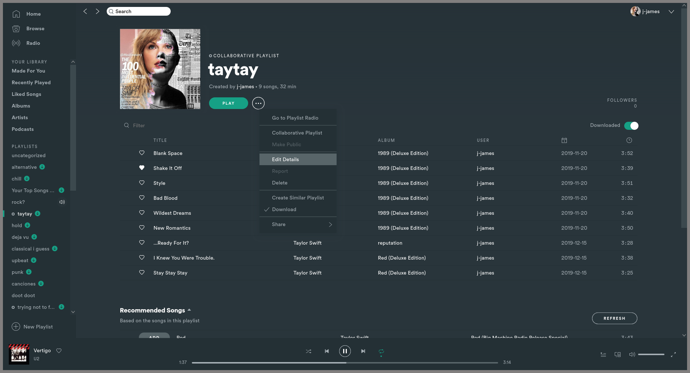

# Adapta-Nokto

An Adapta Nokto colorscheme - no CSS modification.

Note that the borders present in the screenshot are a part of my window manager, and not included with the theme. 

## Screenshots

## More

Theme developed by [@j-james](https://github.com/j-james)

An imitation of [adapta-gtk-theme](https://github.com/adapta-project/adapta-gtk-theme)'s Nokto variant.

If someone figures out what `pressing_fg` or `preserve_1` do, please tell me!
