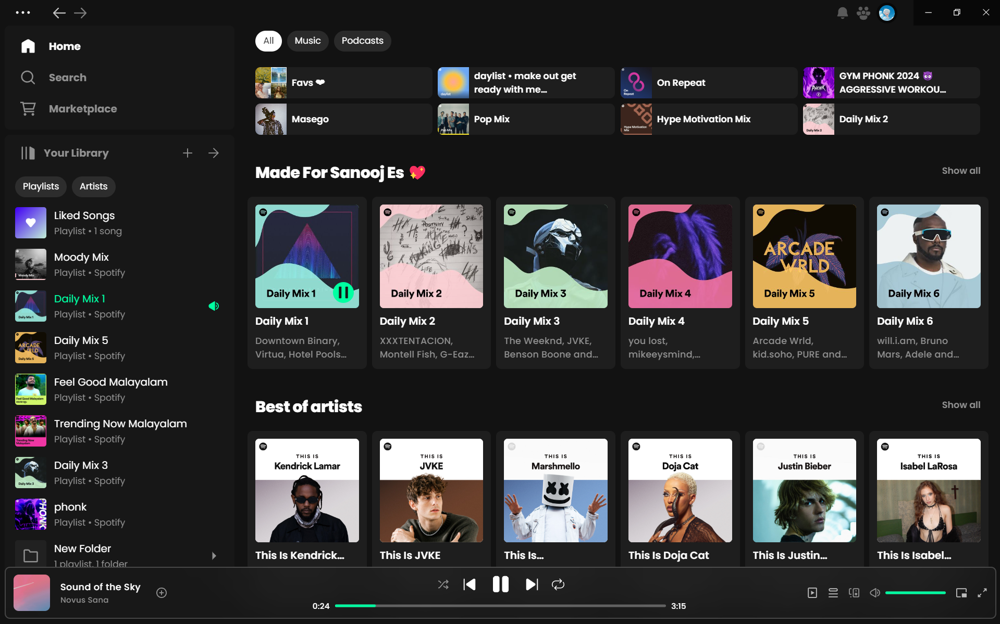
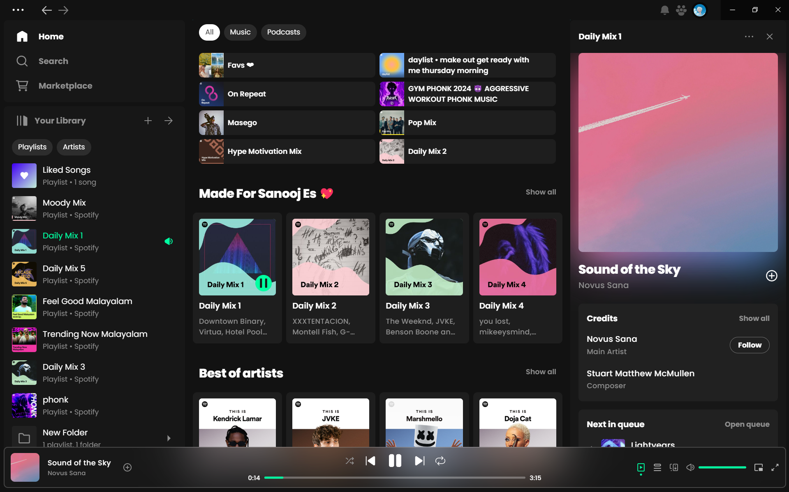
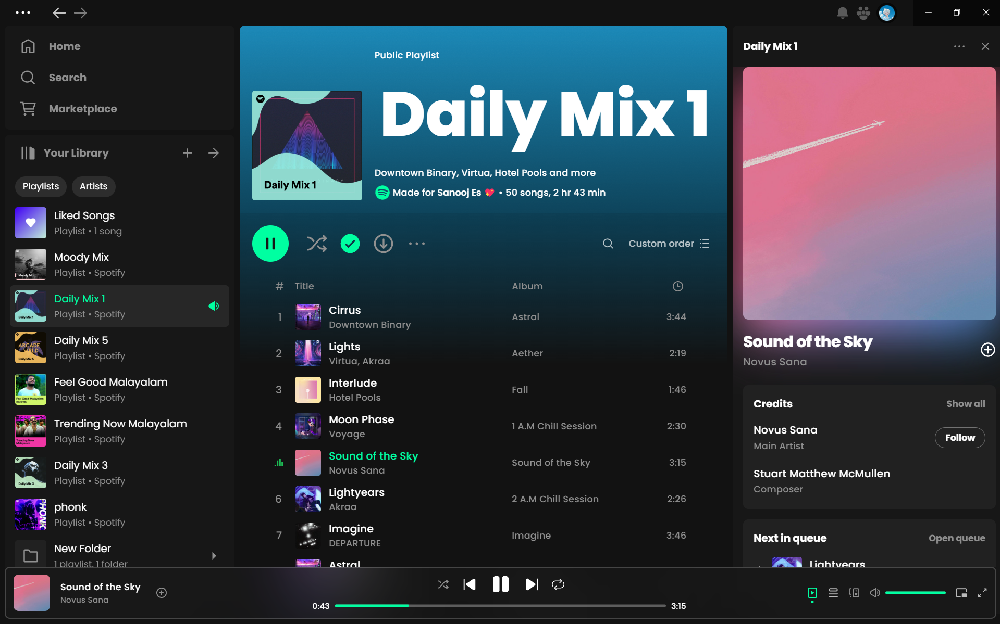
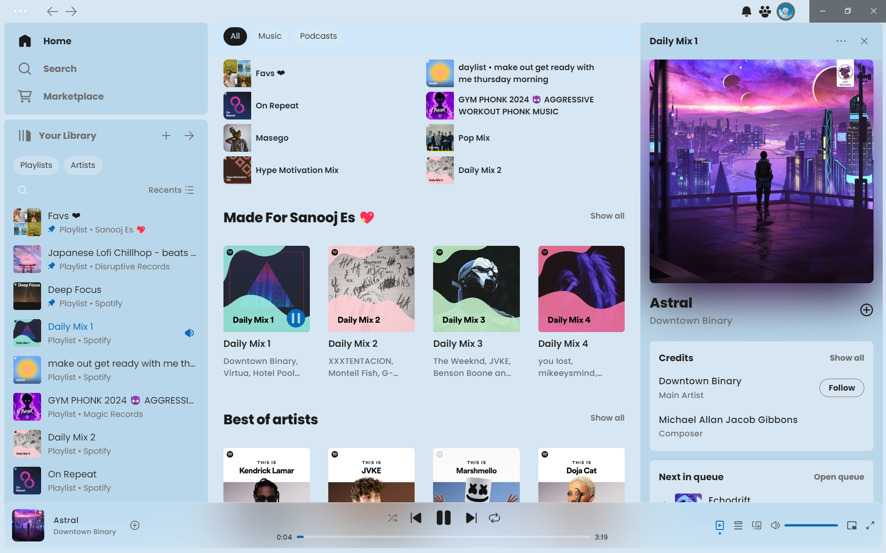
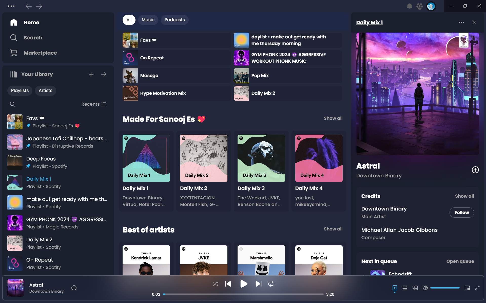
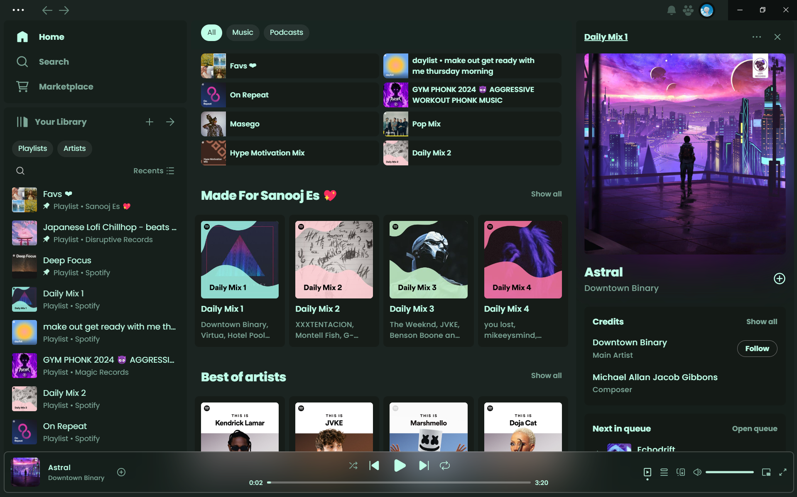
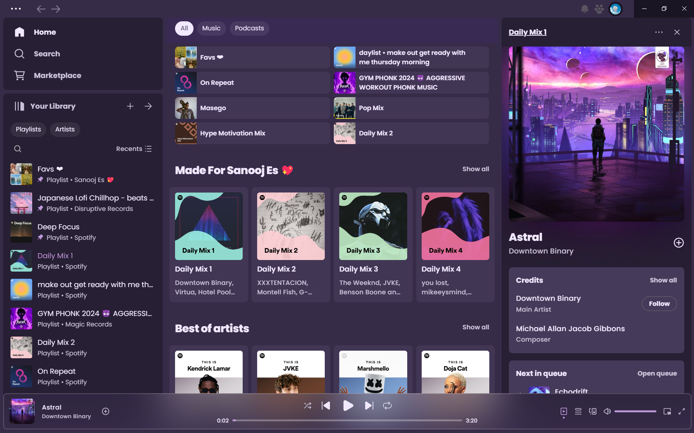
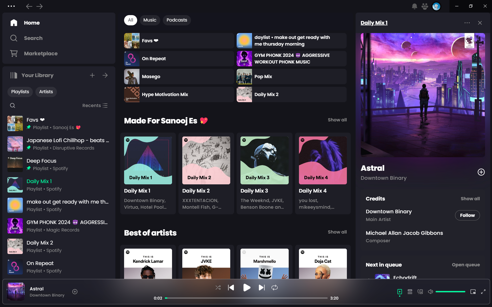

# Better-Bloom

Minimal Bloom theme inspired by [Bloom](https://github.com/nimsandu/spicetify-bloom)

## Screenshots

### Dark (default)





### Light



### Comfy



### Darkgreen



### Violet



### Dark-Fluent


### Dark-Bloom



## Installation

### Scripts

#### Windows (Powershell)

```powershell
[Net.ServicePointManager]::SecurityProtocol = [Net.SecurityProtocolType]::Tls12
iex "& { $(iwr -useb 'https://raw.githubusercontent.com/sanoojes/Better-Bloom/main/install/Better-Bloom.ps1') }"

# Scripts Taken From https://github.com/nimsandu/spicetify-bloom
```

### Spicetify Marketplace (will be added soon)

Simply install [spicetify-marketplace](https://github.com/spicetify/spicetify-marketplace) by following it's
[installation instructions](https://github.com/spicetify/spicetify-marketplace/wiki/Installation). Then look for `Better-Bloom` theme and click the install button.

### Manual Installation

Use this guide to install if you're having trouble using the shell commands/installation scripts:

1. Download this repo as [archive](https://codeload.github.com/sanoojes/Better-Bloom/zip/refs/heads/main).
2. Navigate to the Spicetify's `Themes` directory. Use `spicetify path userdata` command to get the path.
3. In the directory, create a new folder called `Better-Bloom`.
4. Open the downloaded repo archive, and move all of the files from the `src` subfolder to the `Better-Bloom` folder you created.
5. Open a terminal/command prompt window and type the following commands:

   ```shell
    spicetify config current_theme Better-Bloom color_scheme dark
    spicetify config inject_css 1 replace_colors 1 overwrite_assets 1 inject_theme_js 1
    spicetify apply
   ```

## Customization

### Color Scheme

The `dark` color scheme is applied by default during the installation process. If you install Better-Bloom via PowerShell the installed color scheme depends on your Windows settings.

The available color schemes are: `dark` `light` `dark-green` `coffee` `comfy` `dark-fluent` . Apply one using the following commands:

```shell
spicetify config color_scheme <color scheme>
spicetify apply
```

If you installed Better-Bloom from Marketplace you can change the color scheme on its page.

### Accent Color

1. Navigate to the Spicetify's `Themes` directory. Use `spicetify path userdata` command to get the path.
2. Open `Better-Bloom` folder.
3. Edit your current color scheme in the `color.ini` file.
4. Use the `spicetify apply` command.

If you installed Better-Bloom from Marketplace you can change the accent color using built-in `Color.ini Editor`.

## Updating Theme

### Windows (PowerShell)

```powershell
[Net.ServicePointManager]::SecurityProtocol = [Net.SecurityProtocolType]::Tls12
iex "& { $(iwr -useb 'https://raw.githubusercontent.com/sanoojes/Better-Bloom/main/install/Better-Bloom.ps1') } -Action Update"
```

## Credits

volumePercentage, quickQueue ,npvAmbience taken from [ohitstom/spicetify-extensions](https://github.com/ohitstom/spicetify-extensions)

## License

[MIT License](LICENSE)
