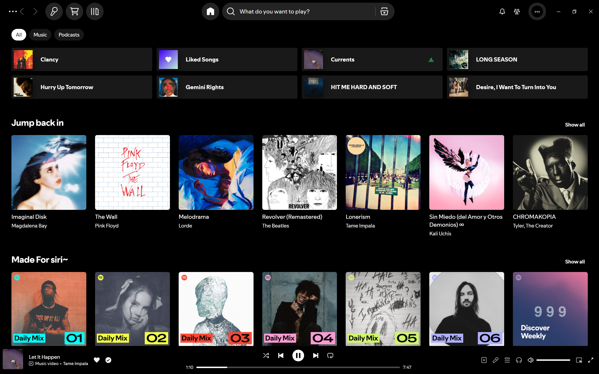
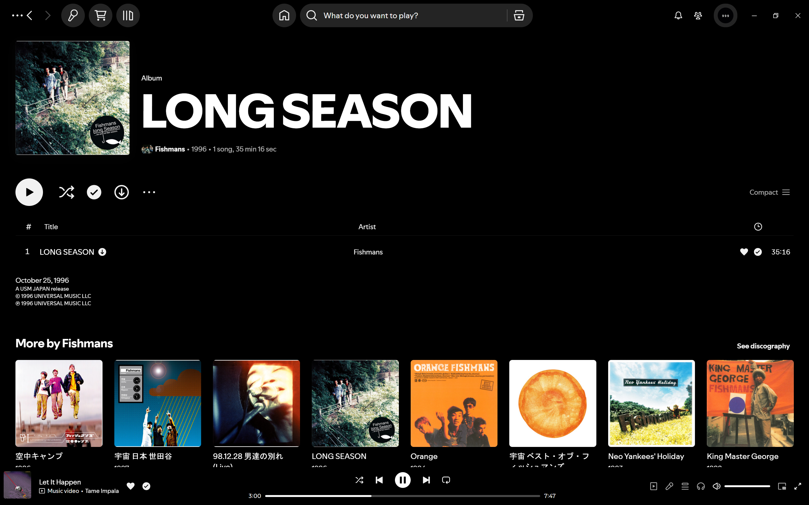
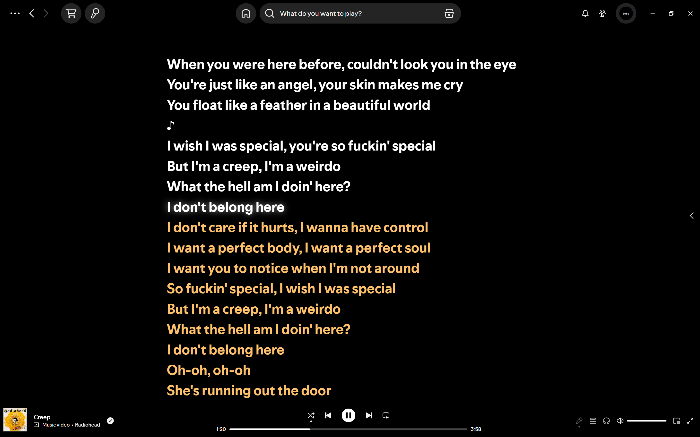

# Blackout

A True Black AMOLED/OLED theme for spicetify.

## Looks

##### Home


##### Album Page


##### Artist Page


##### Lyrics Page 


## Dependencies

- Latest version of [Spicetify](https://github.com/spicetify/spicetify-cli).
- Latest version of [Spotify](https://www.spotify.com/download).

### Manual Installation

Use this guide to install if you're having trouble using the shell commands/installation scripts:

1. Download this repo as [archive](https://github.com/thefoodiee/oledify/archive/refs/heads/main.zip).
2. Navigate to the Spicetify's `Themes` directory. Use `spicetify path userdata` command to get the path.
3. In the directory, create a new folder called `blackout`.
4. Open the downloaded repo archive, and move all of the files from the main folder to the `blackout` folder you created.
5. Open a terminal/command prompt window and type the following commands:

   ```shell
    spicetify config current_theme blackout color_scheme def
    spicetify config inject_css 1 replace_colors 1 overwrite_assets 1 inject_theme_js 1
    spicetify apply
    ```

## Uninstallation

### Manual Uninstallation

```shell
spicetify config color_scheme ' ' current_theme ' '
spicetify apply
```