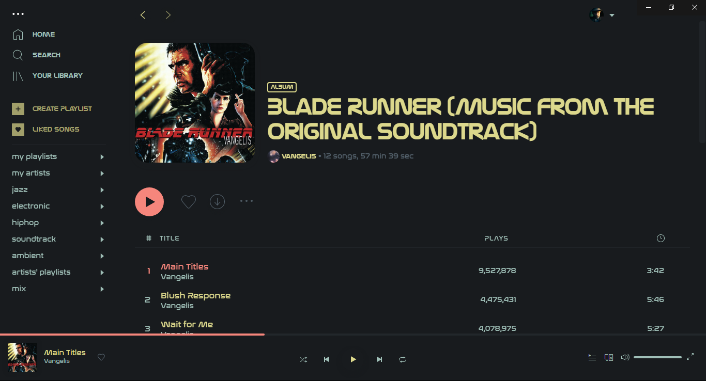

# BladeRunner

Required fonts:
 - Nasalization Regular
 - Nasalization Bold

## Screenshots

### Base

#### 2049

##### Info

The font "Nasalization" is used by default to give the themes futuristic look. If you won't install the font, it will be replaced by "Roboto" or "Arial" on Windows, "Helvetica Neue" on MacOS and "sans-serif" on Linux.

For the base theme, main, sidebar and player background colours are same and based on [Sweet-Mars theme](https://www.gnome-look.org/p/1253385/).

For 2049, main, sidebar and player background colours are same and based on [Dracula gtk](https://draculatheme.com/gtk).

Slightly edited user.css is based on [Sleek theme](https://github.com/morpheusthewhite/spicetify-themes/tree/v2/Sleek).

Author: [canbeardig](https://github.com/canbeardig)
