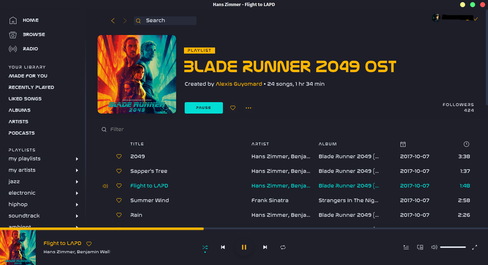

# BladeRunner

Required fonts:
 - Nasalization Regular
 - Nasalization Bold

## Screenshots

### More

The font "Nasalization" is used by default to give it a futuristic look. If you won't install the font, it will be replaced by "Arial" on Windows, and "sans-serif" on Linux.

Main, sidebar and player background colours are same and based on Dracula gtk: https://draculatheme.com/gtk/

Slightly edited user.css is based on Nord spicetify: https://github.com/morpheusthewhite/spicetify-themes/tree/master/Nord

Author: https://github.com/canbeardig
