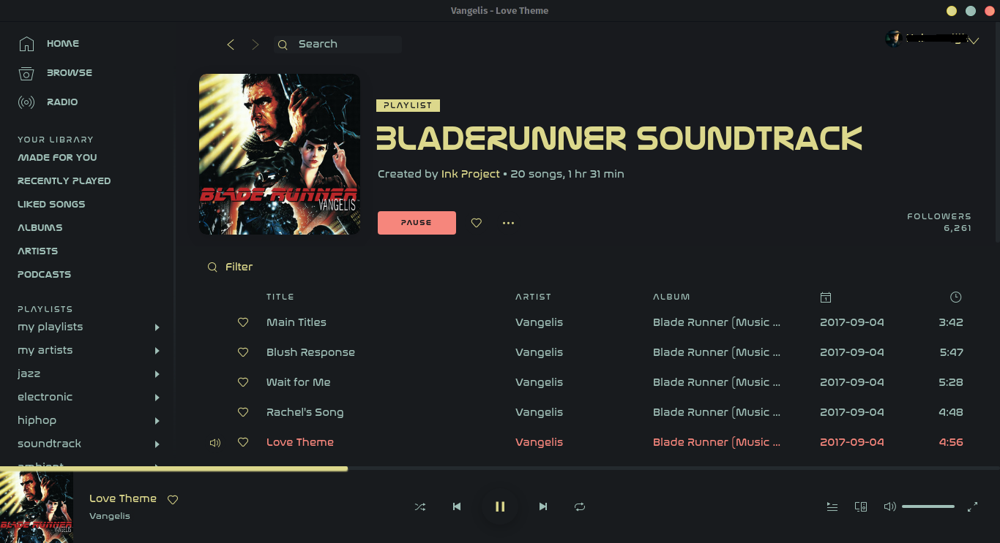
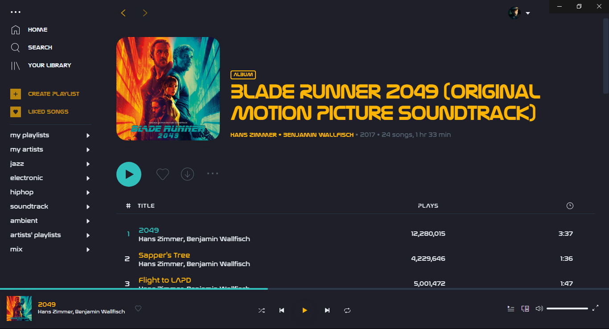

# BladeRunner

Required fonts:
 - Nasalization Regular
 - Nasalization Bold

## Screenshots

### Base

#### 2049

##### Info

The font "Nasalization" is used by default to give the themes a futuristic look. If you won't install the font, it will be replaced by "Arial" on Windows, and "sans-serif" on Linux.

For the base theme, main, sidebar and player background colours are same and based on Sweet-Mars theme: https://www.gnome-look.org/p/1253385/

For 2049, main, sidebar and player background colours are same and based on Dracula gtk: https://draculatheme.com/gtk/

Slightly edited user.css is based on Nord spicetify: https://github.com/morpheusthewhite/spicetify-themes/tree/master/Nord

Author: https://github.com/canbeardig
