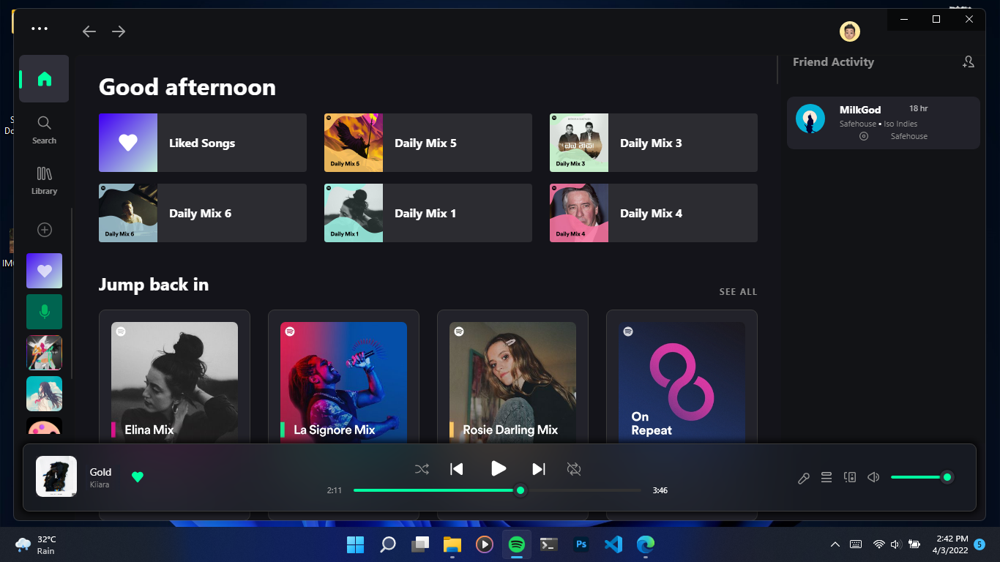

# Bloom

<p align="center">
  <a href="https://github.com/spicetify/spicetify-cli"></a>
  <a href="https://github.com/spicetify/spicetify-cli"></a>
</p>

<!-- Please validate your theme's compatibility with the latest versions often, as we will remove themes that have become unsupported. -->

## Screenshots



### Important

For the sidebar playlists to show properly, ensure that these two lines are added in the Patch section of your `config-xpui.ini` file:

```ini
[Patch]
xpui.js_find_8008 = ,(\w+=)32,
xpui.js_repl_8008 = ,${1}56,
```
