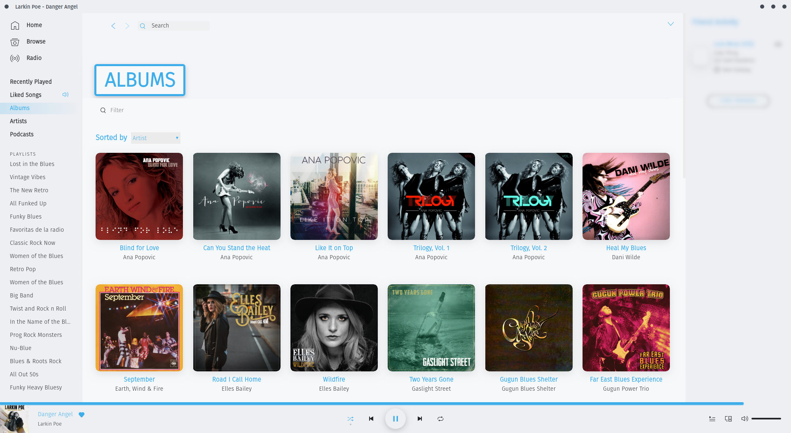
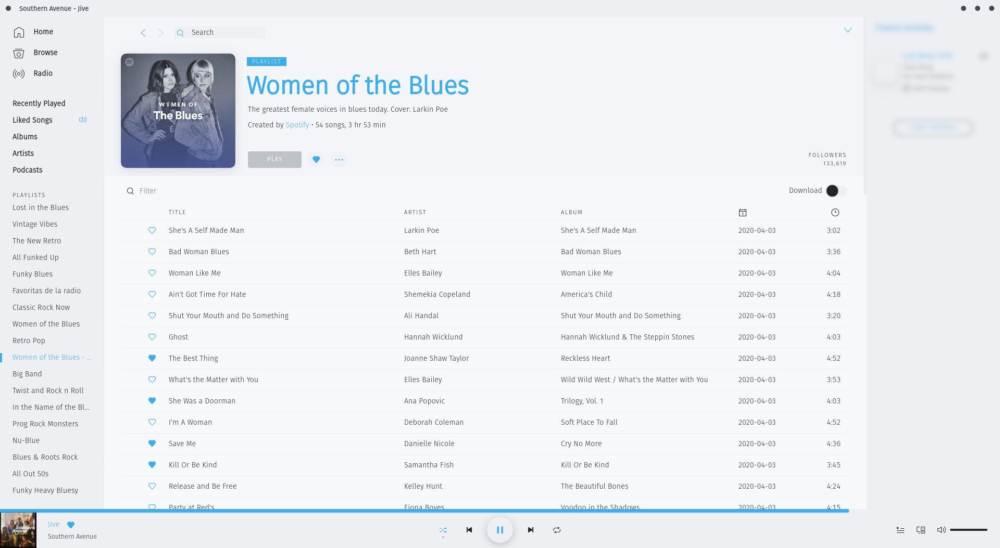

# Breeze Light
## Screenshots

## More

Heavily inspired by Breeze Light theme and purposefully designed to match both [Evolvere Light Pure Circle Inverted Aurorae Theme][1] and [Breeze Light theme][2].

The theme has been thought with [Fira Sans Light][3] in mind -as seen in the screenshots section-. If you want that too, there is a commented bit at the start of user.css; uncomment it and you are good to go.

[1]: https://store.kde.org/s/KDE/p/1002630/ "Evolvere Light Pure Circle Inverted Aurorae Theme"
[2]: https://store.kde.org/p/1181628/ "Breeze Light"
[3]: https://fonts.google.com/specimen/Fira+Sans "Fira Sans"
