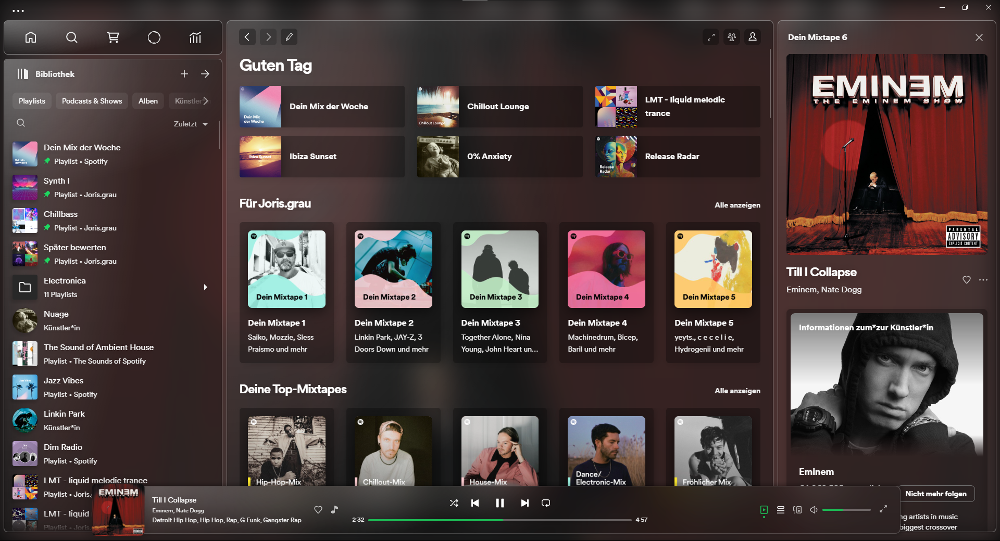
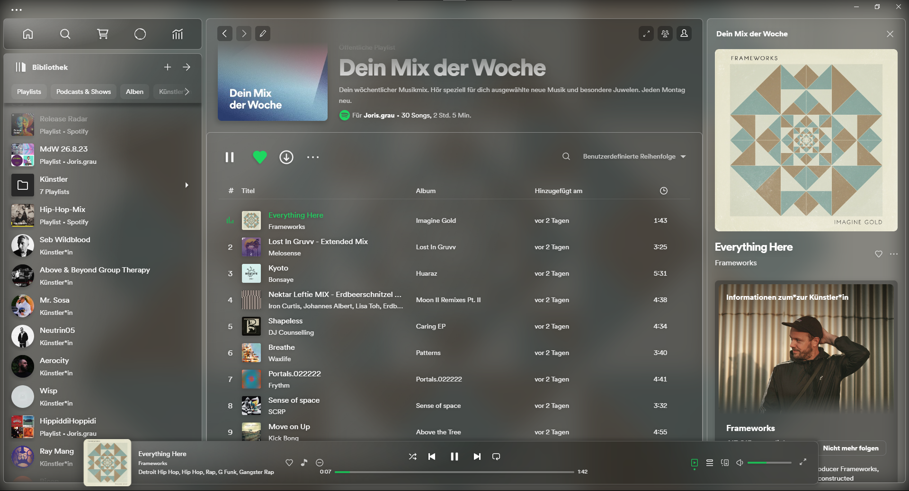
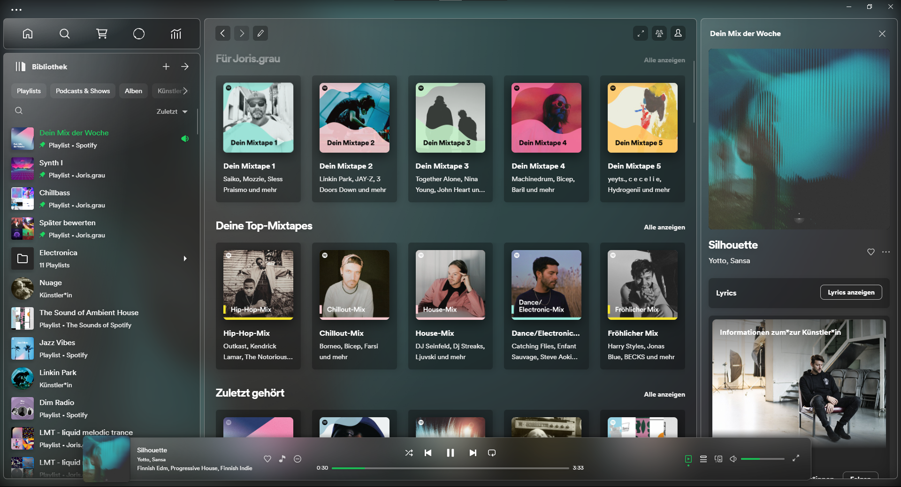

# CrazyHazy 

CrazyHazy is an animation heavy translucent theme for Spotify. It is based on the <a href="https://github.com/Astromations/Hazy">Hazy Theme</a> from Astromations.
Hazy is based on <a href="https://github.com/JulienMaille/spicetify-dynamic-theme">DynamicDefault</a> and <a href="https://github.com/nimsandu/spicetify-bloom">Bloom</a>. 
If you're liking CrazyHazy, Hazy or any of the other themes, please don't forget to ⭐ the project.


## Preview






**Set Background To Album Art and Variables**  

You can adjust some parameters like background blur, contrast and the animation strenght in the Hazy settings menu.
The images use the following settings:

Blur: 25px;
Contrast: 66%;
Saturation: 70%;
Brightness: 120%;
Animation strength: 100;
  

### ⬇️ Automatic Installation ⬇️

Use the Spicetify Marketplace!

### 📃 Manual Installation 📃

---

Download the the repo and put `user.css`, `theme.js` and `color.ini` into a new folder named `CrazyHazy`, and place this folder into your `Themes` folder in `.spicetify`.
Then run these commands to apply:
    
```powershell
spicetify config current_theme CrazyHazy
spicetify config inject_css 1 replace_colors 1 overwrite_assets 1
spicetify apply
```


