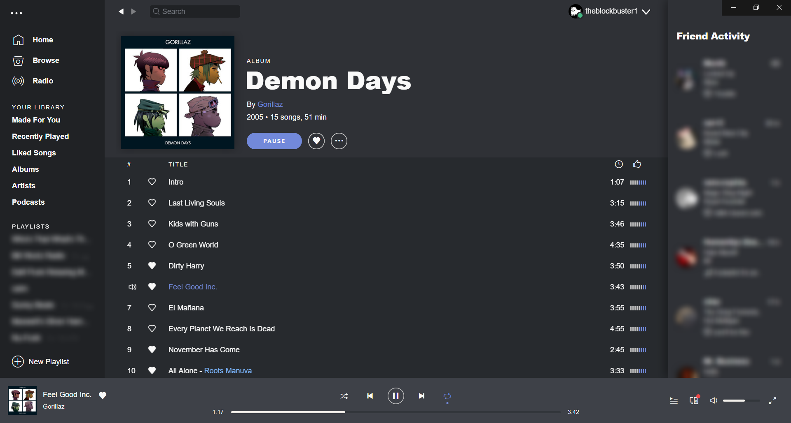
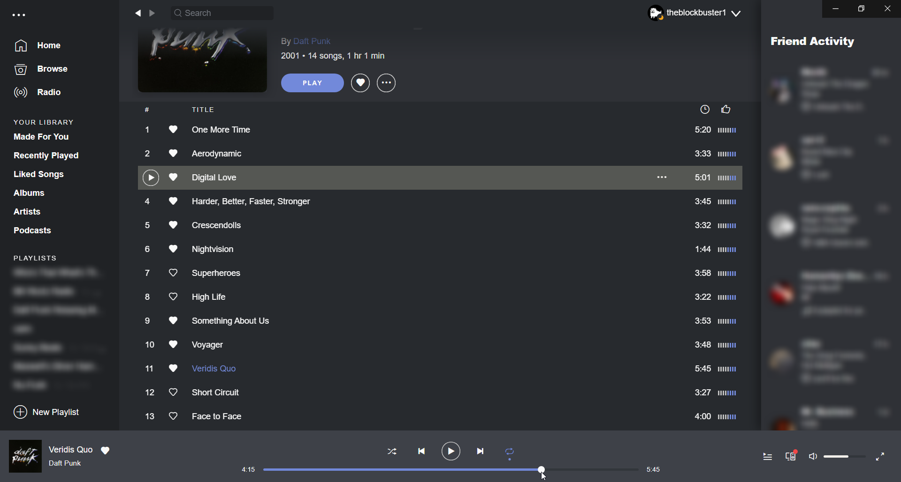
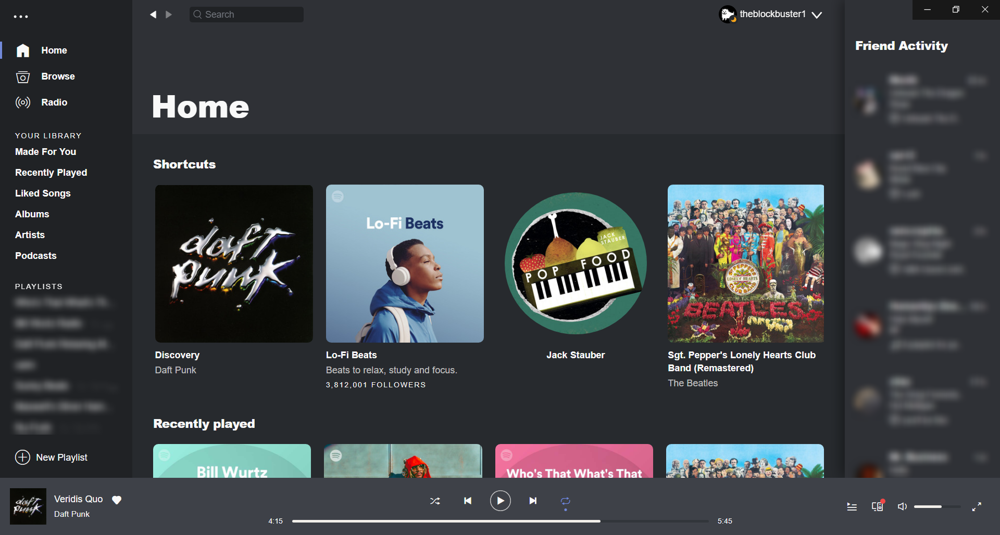

# Discord

## Screenshots

## More

By default it will show that you are 'online' (the green status indicator). To make it change to 'away' when the music is paused, [install the `Discord.js` extension](https://github.com/khanhas/spicetify-cli/wiki/Extensions).

Inspired by [Discord](https://discord.com/) and [this Reddit post](https://www.reddit.com/r/discordapp/comments/l68xjn/if_spotify_were_owned_by_discord/)
