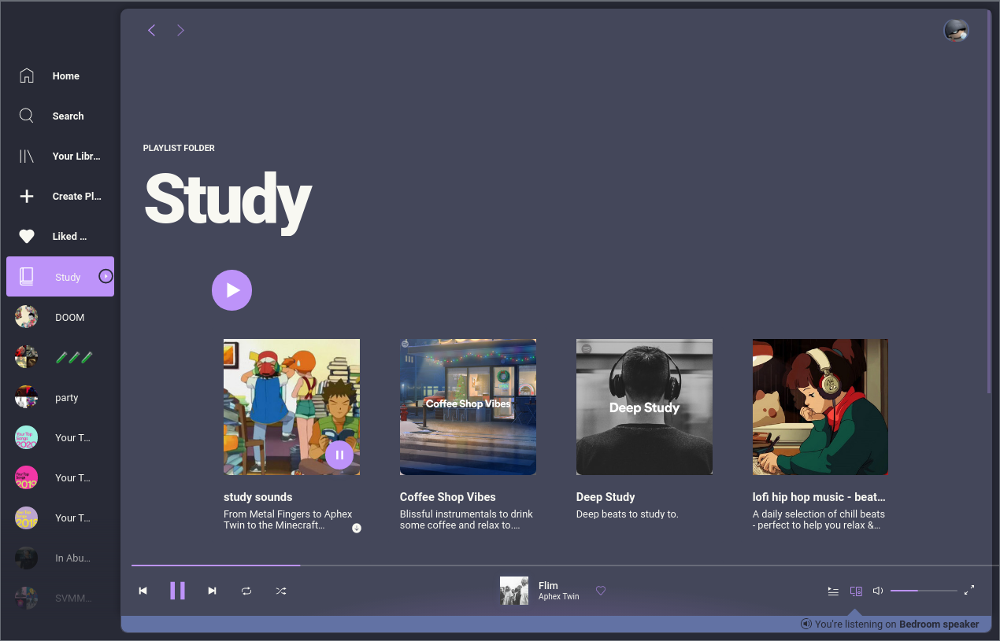
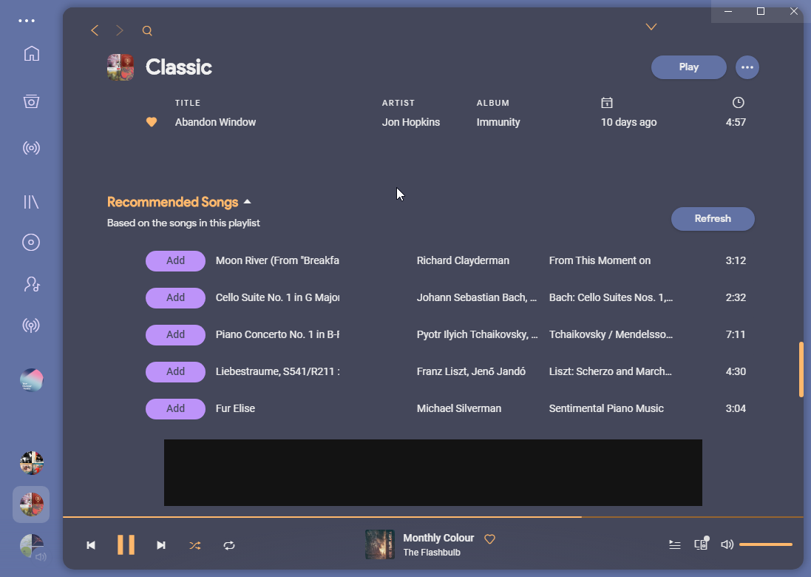
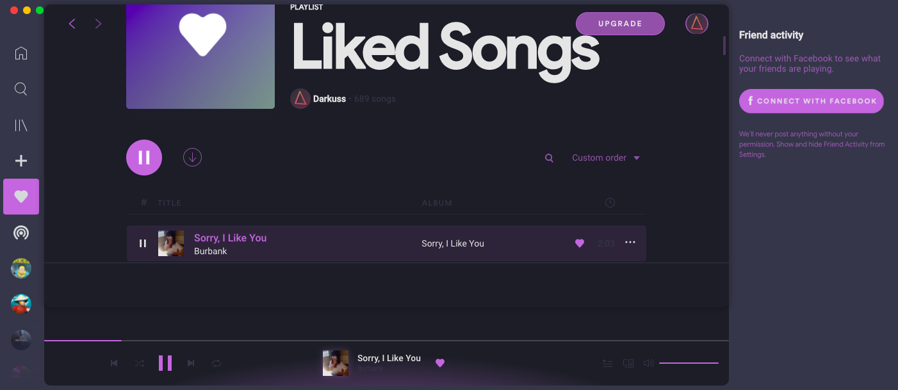

# Dribbblish

## Screenshots
#### Base


#### White


#### Dark


#### Dracula


#### Dracula2


#### Gruvbox


#### Nord-Dark


#### Nord-Light


#### Horizon


#### Samouraï


#### Beach-Sunset


#### Purple


## More
Requires spicetify-cli **v0.9.9 or newer**.

### How to install

Run these commands:

#### Linux and MacOS:
In **Bash**:
```bash
cd "$(dirname "$(spicetify -c)")/Themes/Dribbblish"
mkdir -p ../../Extensions
cp dribbblish.js ../../Extensions/.
spicetify config extensions dribbblish.js
spicetify config current_theme Dribbblish color_scheme base
spicetify config inject_css 1 replace_colors 1 overwrite_assets 1
spicetify apply
```

#### Windows
In **Powershell**:
```powershell
cd "$(spicetify -c | Split-Path)\Themes\Dribbblish"
Copy-Item dribbblish.js ..\..\Extensions
spicetify config extensions dribbblish.js
spicetify config current_theme Dribbblish color_scheme base
spicetify config inject_css 1 replace_colors 1 overwrite_assets 1
spicetify apply
```

### Hide Window Controls
Windows user, please edit your Spotify shortcut and add flag `--transparent-window-controls` after the Spotify.exe:


Alternatively, you can use `SpotifyNoControl.exe`, included in this theme package, to completely remove all windows controls and title menu (three dot at top left corner). Title menu still can be access via Alt key. Closing, minimizing can be done via right click menu at top window region.  
`SpotifyNoControl.exe` could be used as Spotify launcher, it opens Spotify and hides controls right after. So you should make a shortcut for it, change icon and add to desktop or start menu.  
Moreover, by default, Spotify adjusted sidebar items and profile menu icon to stay out of Windows native controls region. If you decided to use `SpotifyNoControl.exe` from now on, please open `user.css` file and change variable `--os-windows-icon-dodge` value to 0 as instruction to snap icons back to their original position.


### Color Schemes
There are 9 color schemes you can choose: `base`, `white`, `dark`, `dracula`, `gruvbox`, `nord-dark`, `nord-light`, `horizon`, `samourai`, `purple`. Change scheme with commands:
```
spicetify config color_scheme <scheme name>
spicetify apply
```

# How to uninstall 

Remove the dribbblish script with the following commands 

```
spicetify config extensions dribbblish.js-
spicetify apply
```

## `color.ini` reference

These keys are used in the `colors.ini` file.

| Key | Target |
|-|-|
|`main_fg`| The main Accent, used for sidebar and some interface elements|
|`main_bg`| The real star of the show, the main Backgroud of app (on the right side)|
|`secondary_fg`| Main text and some other small stuff|
|`secondary_bg`| The background for the left side navbar|
|`selected_button`| Button currenly being hovered|
|`pressing_fg`| The color that momentarialy appears when you press anything|
|`pressing_button_fg`| The textcolor for a pressed button|
|`pressing_button_bg`| BG color for the pressed button|
|`sidebar_and_player_bg`| Background for the player|
|`sidebar_indicator_and_hover_button_bg`| For the slider & selected items when you hover over it|
|`cover_overlay_and_shadow`| Overlay for when you hover over the album covers|
|`slider_bg`| The background for the slider|
|`scrollbar_fg_and_selected_row_bg`| Color for the current selected row|
|`active_control_fg`| Foreground for active control items|
|`indicator_fg_and_button_bg`| Button text color|
|`miscellaneous_bg`| The background color of toolips ("You're offline" etc)|
|`miscellaneous_hover_bg`| Hover Color for the Tooltips|
|`preserve_1`| Misc text colors|
