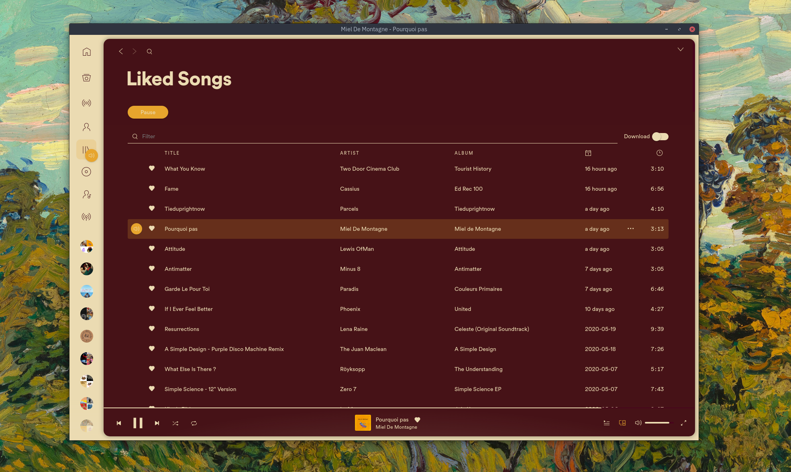
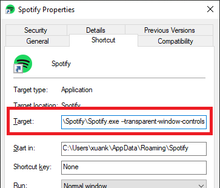

# Dribbblish

### Base

### White

### Dark

### Nord-Light

### Nord-Dark

### Beach-Sunset

### Purple

### Samourai

### Gruvbox


##  Features
### Resizable sidebar

 

### Customizable sidebar
Rearrange icons positions, stick icons to header or hide unnecessary to save space.
Turn on "Sidebar config" mode in Profile menu and hover on icon to show control buttons.
After you finish customizing, turn off Config mode in Profile menu to save.

 

### Playlist Folder image
Right click at folder and choose images for your playlist folder. Every image formats supported by Chrome can be used, but do keep image size small and in compressed format.

 

### Left/Right expanded cover
In profile menu, toggle option "Right expanded cover" to change expaned current track cover image to left or right side, whereever you prefer.

## Auto-install
Make sure you are using spicetify >= v2.5.0 and Spotify >= v1.1.56.
### Windows
```powershell
Invoke-WebRequest -UseBasicParsing "https://raw.githubusercontent.com/morpheusthewhite/spicetify-themes/v2/Dribbblish/install.ps1" | Invoke-Expression
```

## Manual Install
Run these commands:

### Linux and MacOS:
In **Bash**:
```bash
cd "$(dirname "$(spicetify -c)")/Themes/Dribbblish"
mkdir -p ../../Extensions
cp dribbblish.js ../../Extensions/.
spicetify config extensions dribbblish.js
spicetify config current_theme Dribbblish color_scheme base
spicetify config inject_css 1 replace_colors 1 overwrite_assets 1
spicetify apply
```

### Windows
In **Powershell**:
```powershell
cd "$(spicetify -c | Split-Path)\Themes\Dribbblish"
Copy-Item dribbblish.js ..\..\Extensions
spicetify config extensions dribbblish.js
spicetify config current_theme Dribbblish color_scheme base
spicetify config inject_css 1 replace_colors 1 overwrite_assets 1
spicetify apply
```

From Spotify > v1.1.62, in sidebar, they use an adaptive render mechanic to actively show and hide items on scroll. It helps reducing number of items to render, hence there is significant performance boost if you have a large playlists collection. But the drawbacks is that item height is hard-coded, it messes up user interaction when we explicity change, in CSS, playlist item height bigger than original value. So you need to add these 2 lines in Patch section in config file:
```ini
[Patch]
xpui.js_find_8008 = ,(\w+=)32,
xpui.js_repl_8008 = ,${1}56,
```

## Change Color Schemes
There are 9 color schemes you can choose: `base`, `white`, `dark`, `dracula`, `nord-dark`, `nord-light`, `samourai`, `purple`. Change scheme with commands:
```
spicetify config color_scheme <scheme name>
spicetify apply
```

## Hide Window Controls
Windows user, please edit your Spotify shortcut and add flag `--transparent-window-controls` after the Spotify.exe:


Alternatively, you can use `SpotifyNoControl.exe`, included in this theme package, to completely remove all windows controls and title menu (three dot at top left corner). Title menu still can be access via Alt key. Closing, minimizing can be done via right click menu at top window region.  
`SpotifyNoControl.exe` could be used as Spotify launcher, it opens Spotify and hides controls right after. You can drag and drop it to your taskbar but make sure you unpin the original Spotify icon first. Alternatively you can make a shortcut for it and add to desktop or start menu.  
Moreover, by default, Spotify adjusted sidebar items and profile menu icon to stay out of Windows native controls region. If you decided to use `SpotifyNoControl.exe` from now on, please open `user.css` file and change variable `--os-windows-icon-dodge` value to 0 as instruction to snap icons back to their original position.


## Auto-uninstall 
### Windows
```powershell
Invoke-WebRequest -UseBasicParsing "https://raw.githubusercontent.com/morpheusthewhite/spicetify-themes/v2/Dribbblish/uninstall.ps1" | Invoke-Expression
```

## Manual uninstall 
Remove the dribbblish script with the following commands 

```
spicetify config extensions dribbblish.js-
```
And remove Patch lines you added in config file earlier. Finally, run:
```
spicetify apply
```