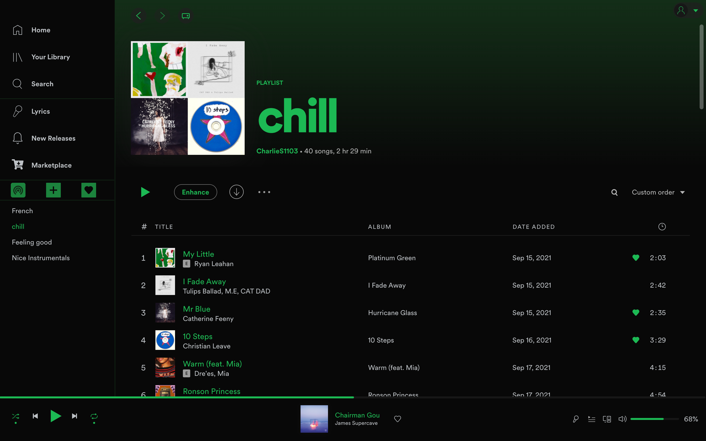
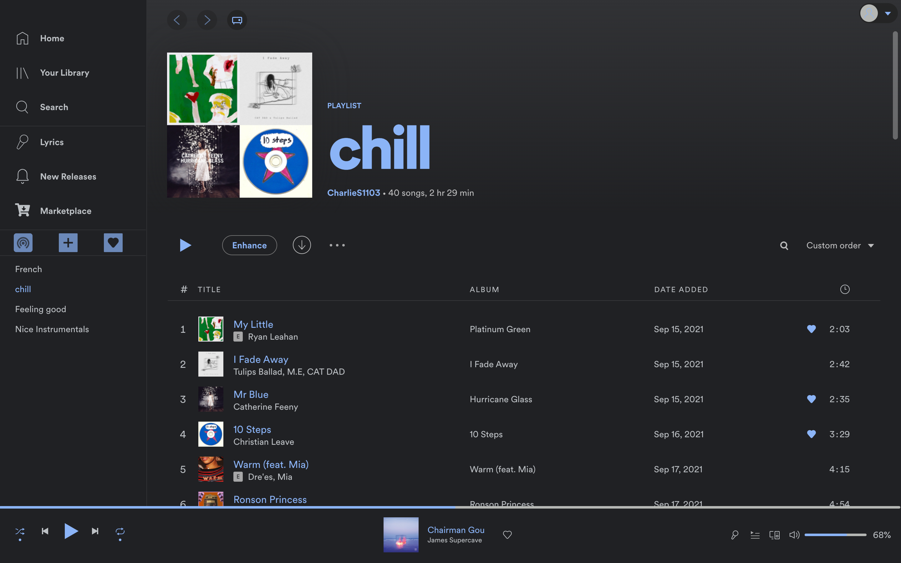
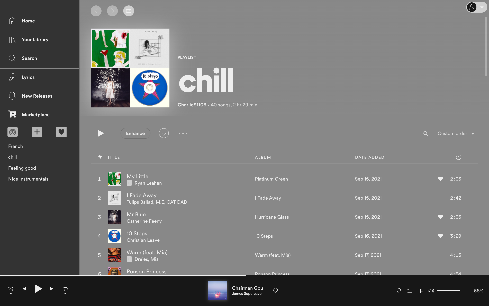

# Glaze

  
  

<!-- Please validate your theme's compatibility with the latest versions often, as we will remove themes that have become unsupported. -->

## Screenshots

### Base

### Dark

### Gray

## Important

It may be necessary to enable sidebar config to make certain aspects of the theme.

##### To enable: `spicetify config sidebar_config 1`

## Author

[CharlieS1103](https://github.com/CharlieS1103)
