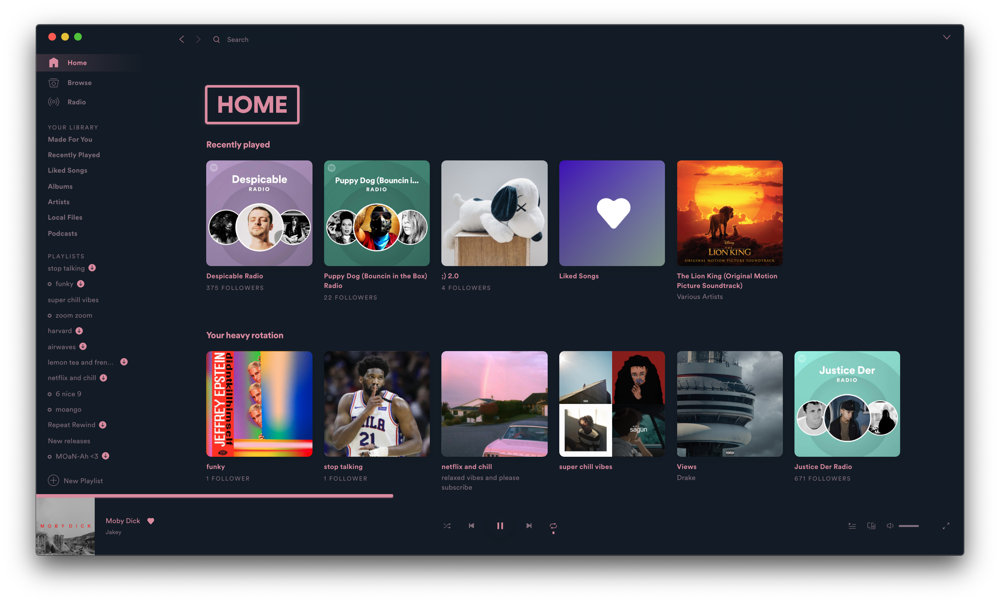
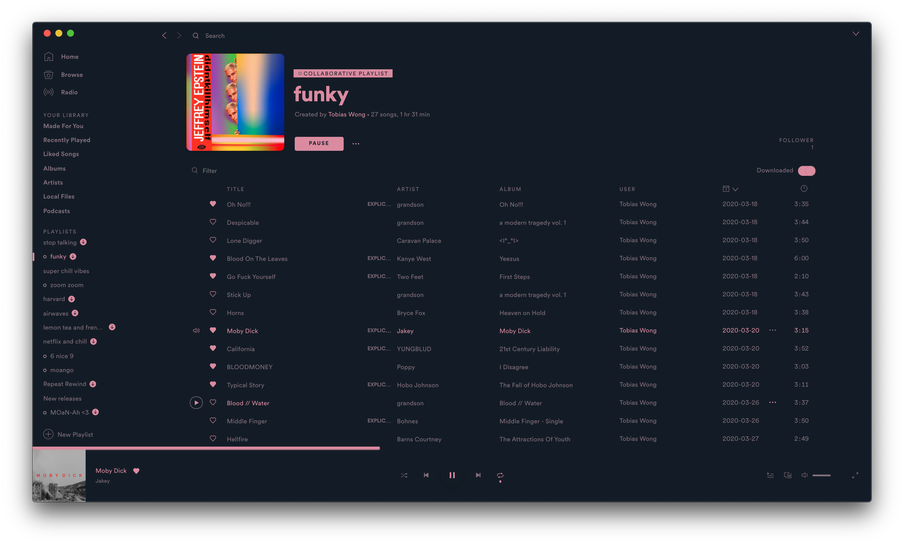

# JarvisBot

## Screenshots

### JarvisBot

### DanDrumStone

### CherryBlossom

### Coral

## More

Source: https://github.com/DoubleJarvis/SpicetifyThemes

CherryBlossom and Coral developed by [@toby-wong](github.com/toby-wong)

If someone can figure out the following issues please let me know :)
- corner radius when hovering to edit playlist image
- downloaded status is fully colored
- connect to device shadow

