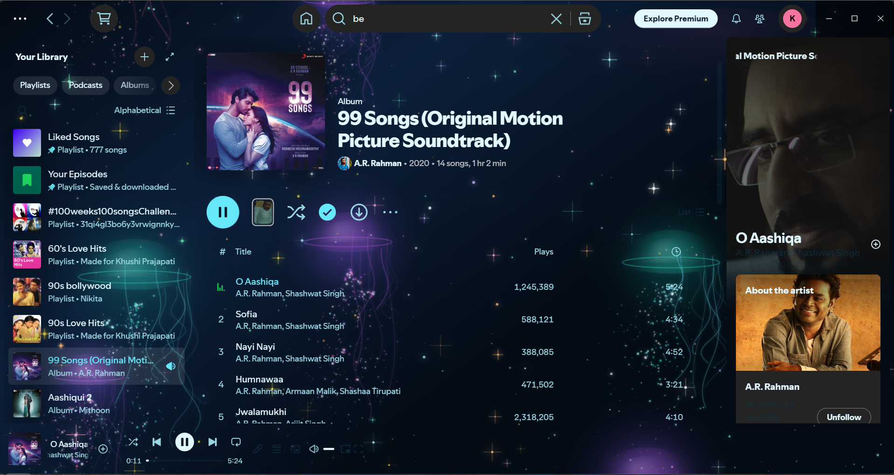
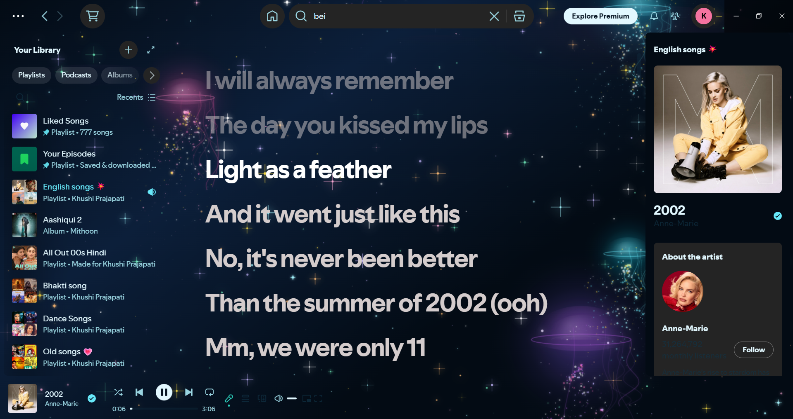

# 🌌 JellyNova: The Bioluminescent Abyss

A custom, hyper-realistic Spicetify theme designed for an immersive music experience. **JellyNova** features a "Zero-Border" architecture where the UI floats over a living, breathing cosmic ocean filled with bioluminescent jellyfish.

## ✨ Highlights
* **Zero-Border Architecture:** Completely removed all section lines and dividers for a seamless "single-pane" experience.
* **Bioluminescent Jellyfish Engine:** Custom JavaScript-driven jellyfish with physics-based movement and "Pearl-String" tentacles.
* **Liquid Diamond Base:** A deep nebula background (Aqua, Sea-Green, and Magenta) with micro-glitter ripples.
* **High-Density Starfield:** 450+ multi-colored twinkling stars with variable intensity.
* **Glassmorphism UI:** Floating media cards and player bar with blur saturation for maximum readability.

## 📸 Preview




### Created by

- https://github.com/khushi-prajapati30

## 🛠️ Installation
1. Place the `JellyNova` folder in your Spicetify `Themes` directory.
2. Open your terminal and run:
   ```powershell
   spicetify config current_theme JellyNova
   spicetify apply
