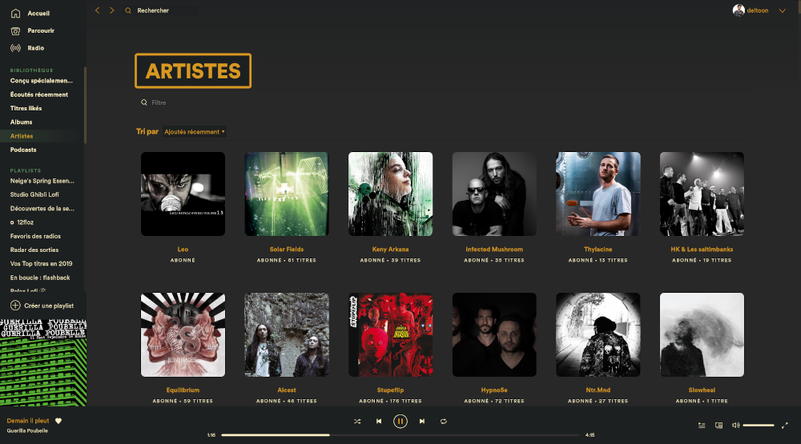

# Kaapi
## Screenshots
### Base
This is the default color scheme.

### Gruvbox
This is an alternative color scheme that uses the Gruvbox color palette. https://github.com/morhetz/gruvbox-contrib

## Info
To change the color scheme, use these commands:
```bash
spicetify config color_scheme <scheme name>
spicetify apply
```
