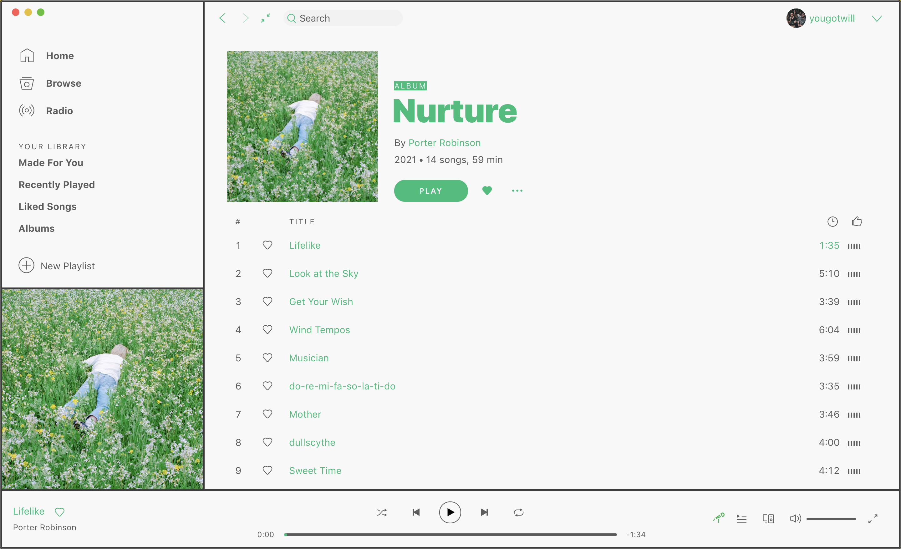

# Koushi Theme

A light and dark minimalist theme for Spotify. Theme colours change according to the macOS system appearance. You need [Spicetify](https://github.com/khanhas/spicetify-cli) to install this theme. This theme supports the new Spotify Desktop UI. For the Classic Desktop UI go to the [legacy](https://github.com/yougotwill/Koushi/tree/legacy) branch.

Name comes from **格子** which means lattice; latticework; window bars; grid; grating.

## Screenshots

### Dark (default)

### Light

## More

Dark theme colours inspired by [FullBlack](https://github.com/cyacedev/spicetify-FullBlack).

Light theme colours inspired by [SpicetifyDefault ](https://github.com/khanhas/spicetify-cli/tree/master/Themes/SpicetifyDefault).

[Toggle colors according to the macOS system appearance](https://github.com/khanhas/spicetify-cli/issues/423#issuecomment-785224958)