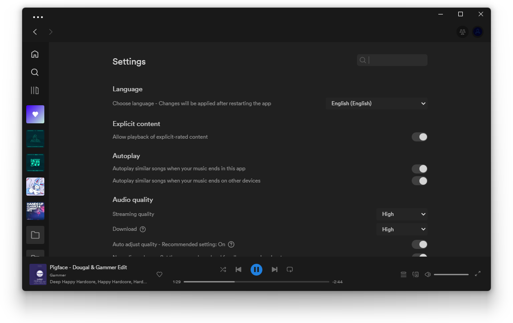
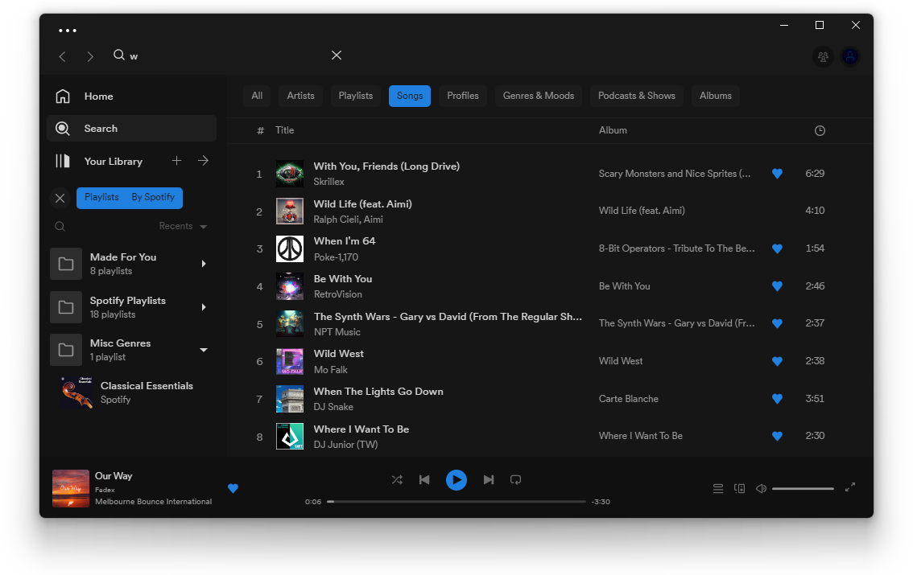
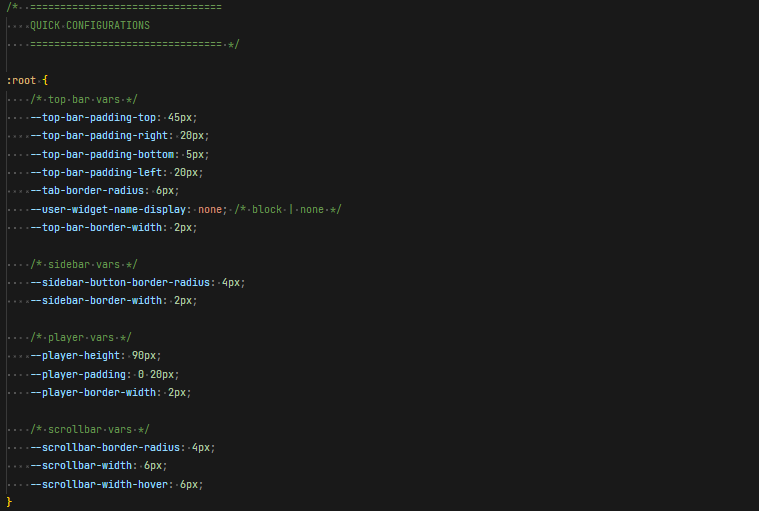
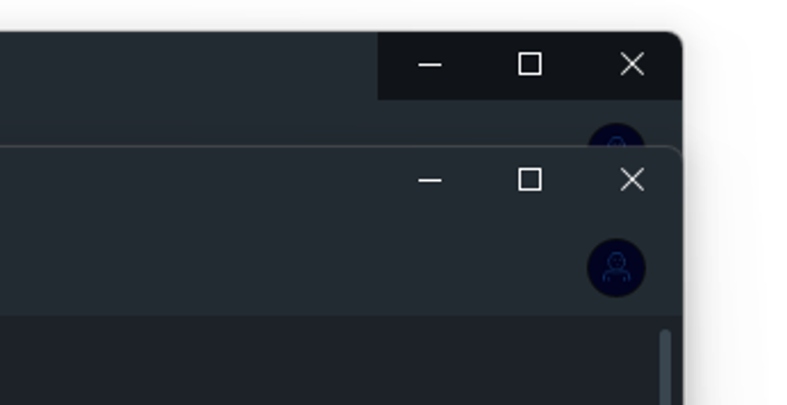

# Matte

## Screenshots

### Matte


### Periwinkle


### Periwinkle-Dark


### Porcelain


### Gray-Dark1


### Gray-Dark2



### Gray-Dark3



### Gray


### Gray-Light


## More

### Description

a Spicetify theme which features a distinct top bar, quick-to-edit CSS variables, and color schemes from Windows visual styles by KDr3w

### Credits

-   Based on [Matte by KDr3w](https://www.deviantart.com/kdr3w/art/Matte-758699852) and their [other themes](https://www.deviantart.com/kdr3w/gallery/68078309/windows-10-themes)

-   Created by [darkthemer](https://github.com/darkthemer)

### Notes

-   Check the very top of `user.css` for quick configs

    -   If you use the Marketplace, go to `Marketplace > Snippets > + Add CSS` and then paste the quick configs found in `user.css`. Edit these as you wish.



-   For Windows users, here's how to make the window controls' background match with the topbar background

    -   Put this snippet into your `user.css` (or through the Marketplace's custom CSS feature)

```css
/* transparent window controls background */
.spotify__container--is-desktop:not(.fullscreen) body::after {
    content: "";
    position: absolute;
    right: 0;
    z-index: 999;
    backdrop-filter: brightness(2.12);
    /* page zoom [ctrl][+] or [ctrl][-]
       edit width and height accordingly
    */
    width: 135px;
    height: 48px;
}
```


