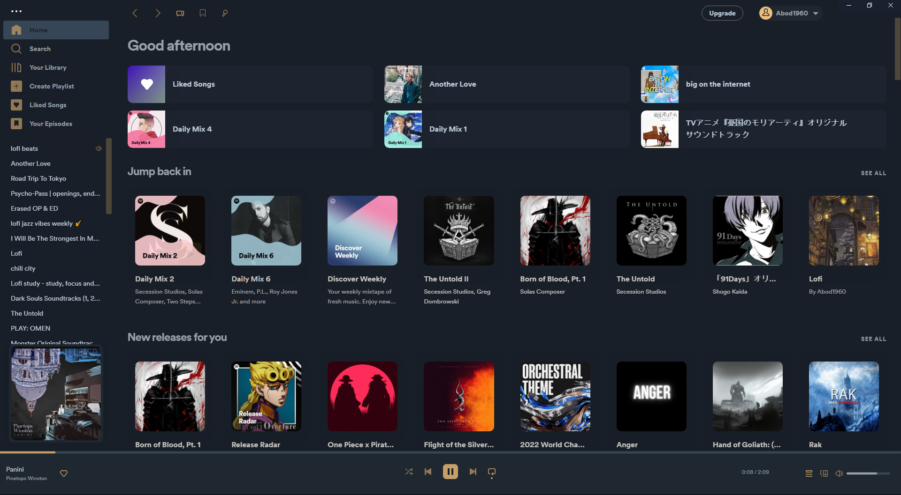
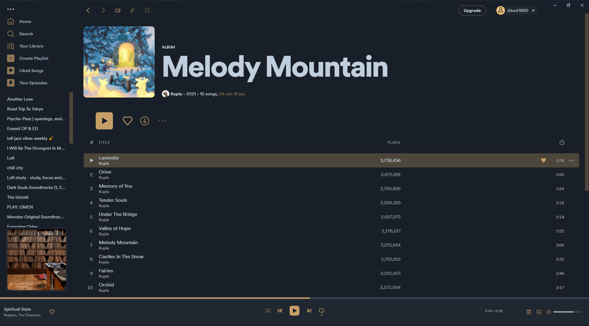
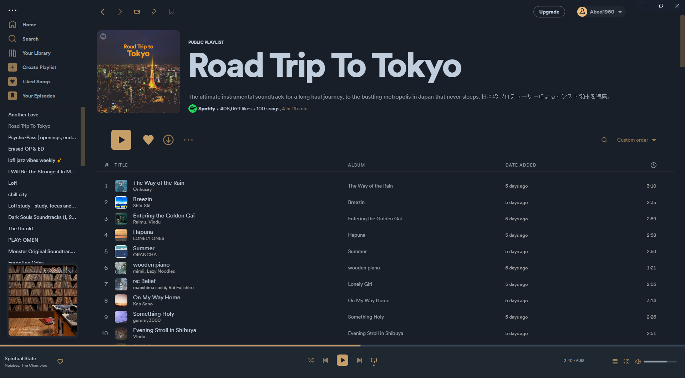
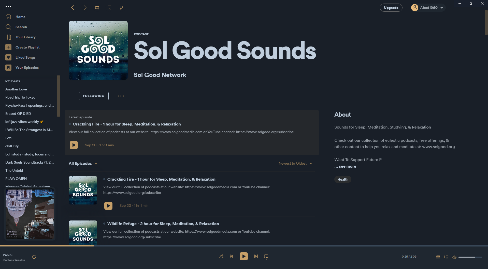
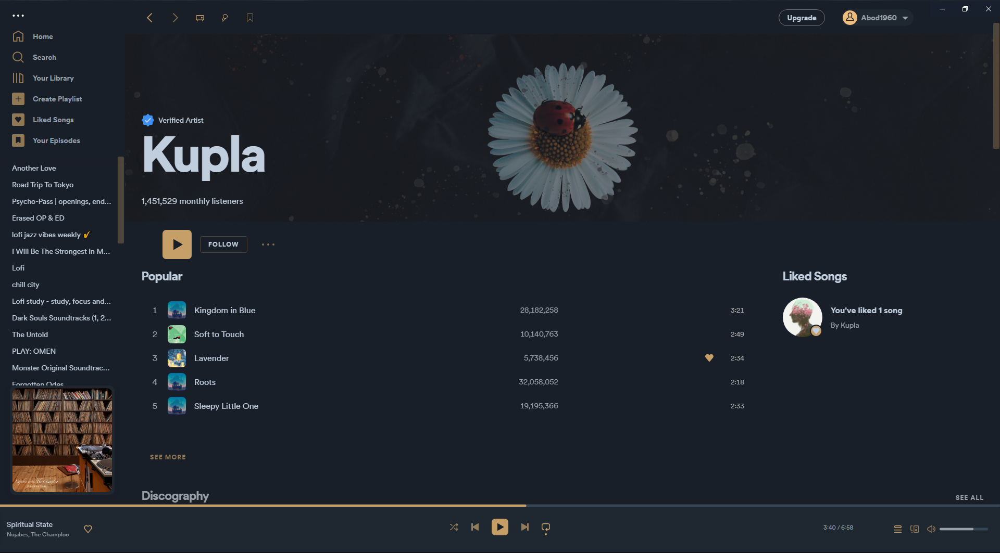
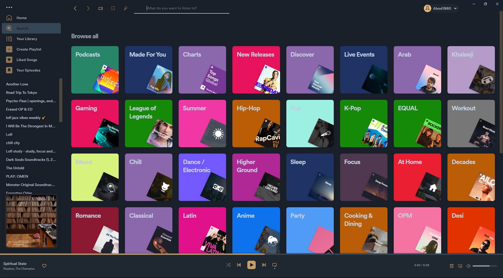

<p align="center">
    
</p>
<br>
<h2 align="center"> <b>Moonlight</b> </h2>
<p align="center">"Moonlight Spotify" 🏕
</p>


<h2 style="display: flex; flex-direction: row; justify-content: start;">  Description</h2>

[Moonlight](https://github.com/Moonlight-theme) is a dark color theme inspired by the camping vibe 🏕

This theme is as simple as possible with some tiny changes to the UI to keep your Spotify as you know it with some minor enhancements and to have Spotify added to your moonlight setup...


<h2 style="display: flex; flex-direction: row; justify-content: start;">  Gallery</h2>

|      |      |  |
| :-------------------------------------------: | :---------------------------------------------: | :-----------------------------------------------: |
|                     home                      |                      album                      |                     playlist                      |
|  |  |    |
|                    podcat                     |                     profile                     |                     search                        |

<h2 style="display: flex; flex-direction: row; justify-content: start;">  Utilization</h2>

* To apply this theme:

    ```shell
    spicetify config current_theme Moonlight
    spicetify apply
    ```
<div align= "center">

</div>