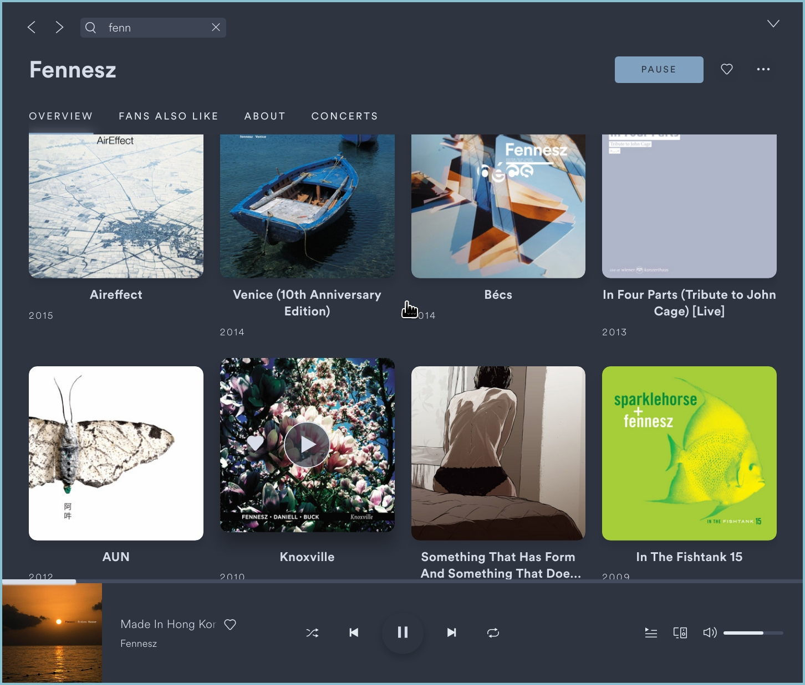

# Nord

## Screenshots

Window: 

Full desktop: 

### Minimal theme ###

You can replace `user.css` with `minimal.css`, which hides spotify's sidebar. Probably not everyone's cup of tea, but it does showcase what's possible with spicetify. Additionally, it clears up a lot of screen space (if you don't require the sidebar, like me), and fits better in small tiling wm spaces.

## More

Based on the excellent [Nord](https://github.com/arcticicestudio/nord) color scheme. Pairs really well with other Nord apps. The `user.css` has been slightly modified to disable scrollbars.

