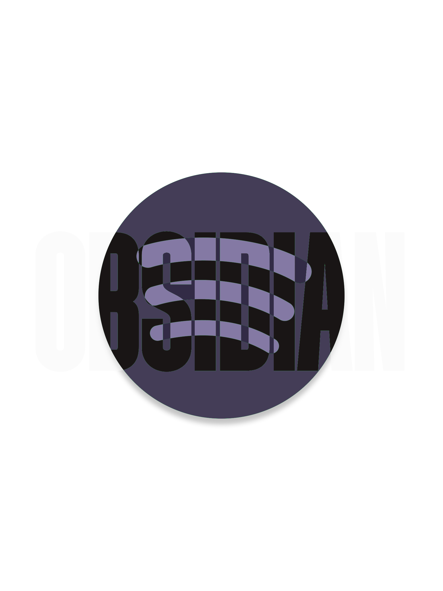
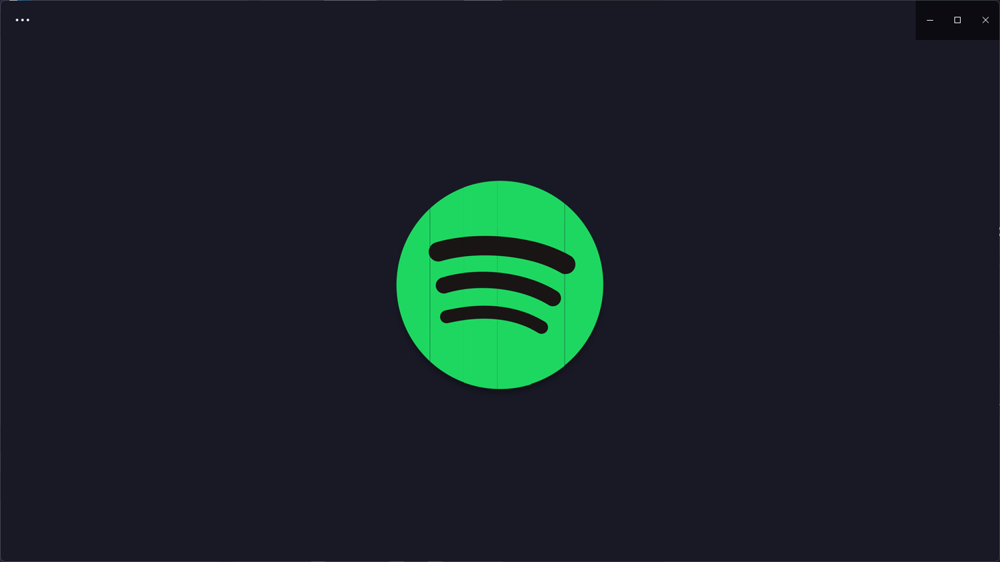
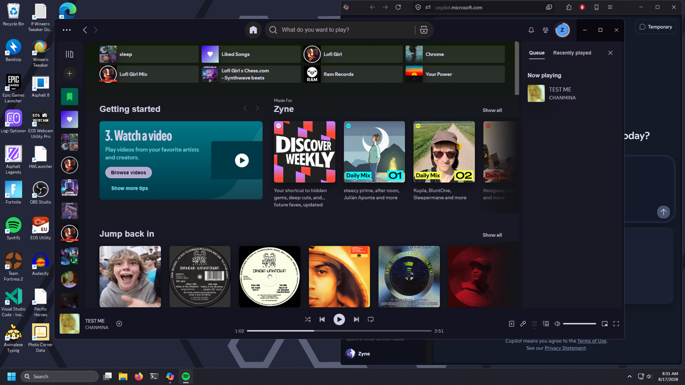
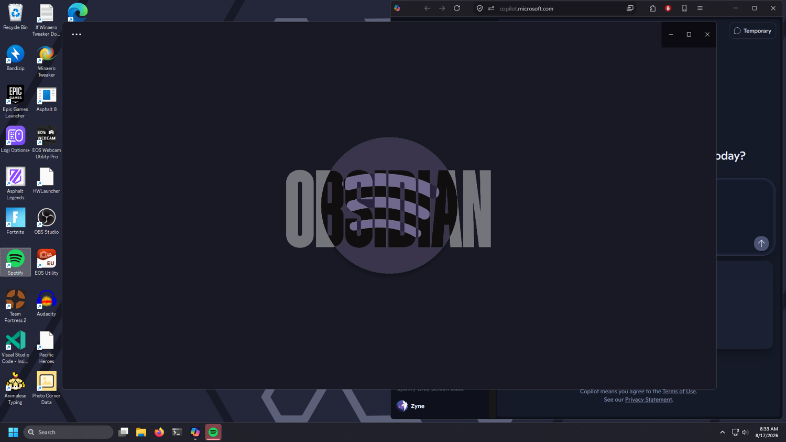

# OBSIDIAN




A cold, dark theme based on a cold, dark stone. Obsidian is a theme that packs grayish-purple colors and has an ominous splash screen. Designed for users who want Spotify to look minimalistic and want a sleek, clean UI.


## Preview








## Features

- Gray-purple colors

- Dark aesthetic

- Custom sidebar, player bar, and hover states

- `theme.js` includes a splash-screen

- Fully compatible with Spicetify Marketplace


## Installation

Install through the Spicetify Marketplace, or manually place the **OBSIDIAN** folder into `spicetify-config-dir`. Then apply the theme using:

```pwsh

spicetify config current_theme OBSIDIAN

spicetify apply

```


## Credits

Created by zyne

[GitLab](https://gitlab.com/plutek) • [Reddit](https://reddit.com/u/Actual_Wait5660)

