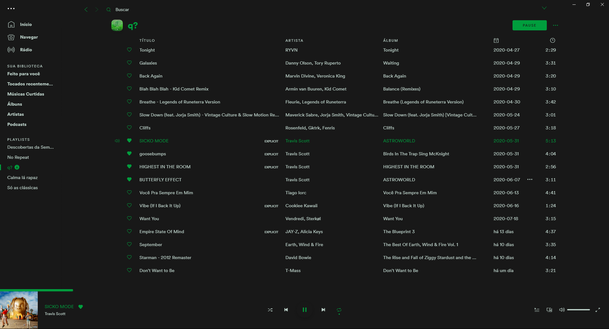
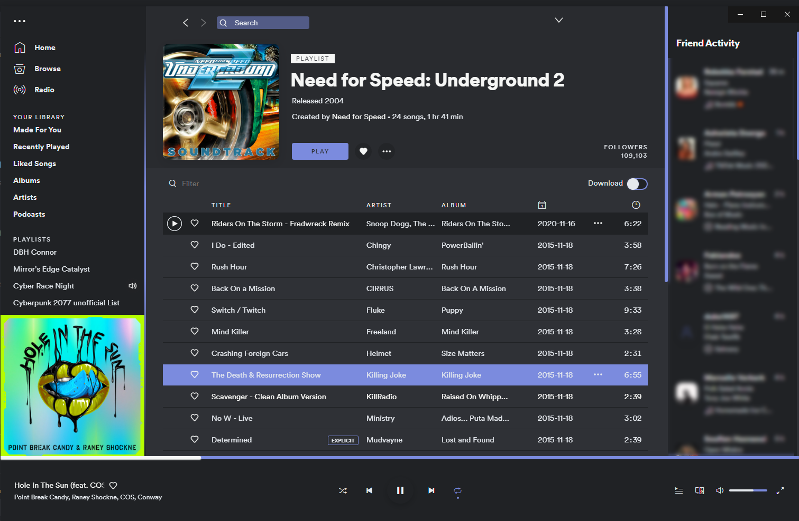

# OneDarkish

### Base

### VPFut

### Discord

## More

Inspired by [One Dark UI](https://atom.io/themes/one-dark-ui). Feedback is always appreciated :).

VPFut color scheme developed by [Caio Domingues](https://github.com/caiodomingues)

Discord color scheme developed by [@davomyan](https://github.com/DavoMyan)
Twitter: [@davomyan](https://twitter.com/DavoMyan)
