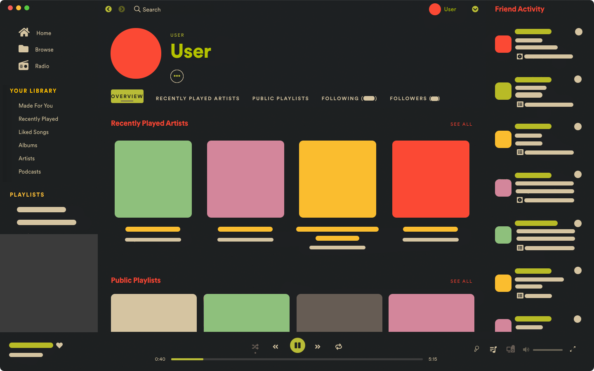
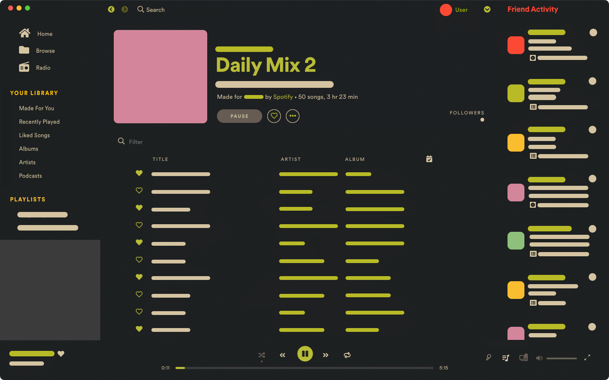

# Onepunch
## Screenshots

## More

#### About
A simple gruvified spotify theme. 

#### First Aid Kit  ¯\\_(ツ)\_/¯

- Tested on macOS only and pretty much everything worked. 
- Just in case, if the icons/fonts doesn't change or broke(mostly for other untested platforms), then try to replace the `spoticon_xxx` font file in your `glue-resources` folder with this [spoticon_xxx](./assets/glue-resources/fonts/spoticon_cb67241fb50eae02396ee4647eb9a2e6.ttf) font file. 
- In macOS it is `/Applications/Spotify.app/Contents/Resources/Apps/glue-resources/` I'm sure you can find your's ﾍ(･_|

#### On my list
- [x] Gruvified that old Onepunch theme.
- [x] Changed almost not a few icons.
- [ ] Fix a few minor layout mismatch.
- [ ] Modify a lot of icons.
- [ ] Watch anime. 〜〜(／￣▽)／　〜ф

#### Contact
Go **[here](https://github.com/okarin001/Onepunch/issues)** and _check/create_ an issue in case you face any probelm. 
