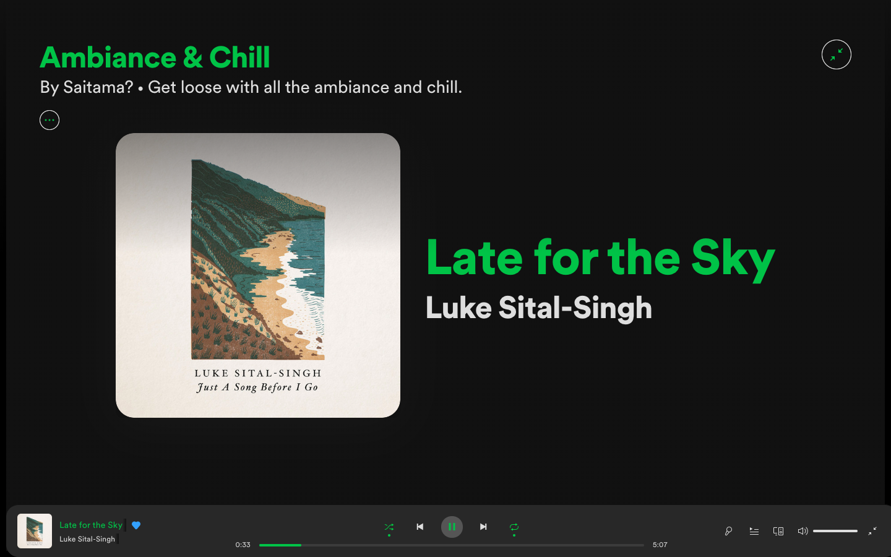

# Onepunch by Saitama D. Luffy

## Screenshots

## More

#### Details

>&nbsp;&nbsp;&nbsp;&nbsp;A project intended to redesign the Spotify app.As you know Saitama is only a "hero for fun", this is going to take a while even though he can finish an enemy with just one punch. I hope you'll like it! Suggestions will always help me to make it look better.
So, feel free to drop your feedback in the given contact details.

#### A little help
>To enable this theme type this code in your terminal app :
>
>      $spicetify config current_theme Onepunch
>        //For more details go to spicetify github homepage.

>To change between **day and night mode** just use this code in your terminal app :
>
>      $spicetify config color_scheme SCHEME
>       //Replace SCHEME by BASE/base or DARK/dark for DAY or NIGHT mode respectively.
>       //Schemes are case-insensitive.

#### Contact

For *feedback* and *reporting bugs* only.  
&nbsp;&nbsp;&nbsp;&nbsp;[Telegram](https://t.me/saitama_a)  
&nbsp;&nbsp;&nbsp;&nbsp;[Twitter](https://twitter.com/_saitama_0)
