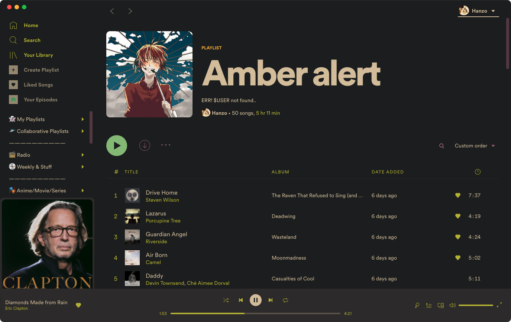
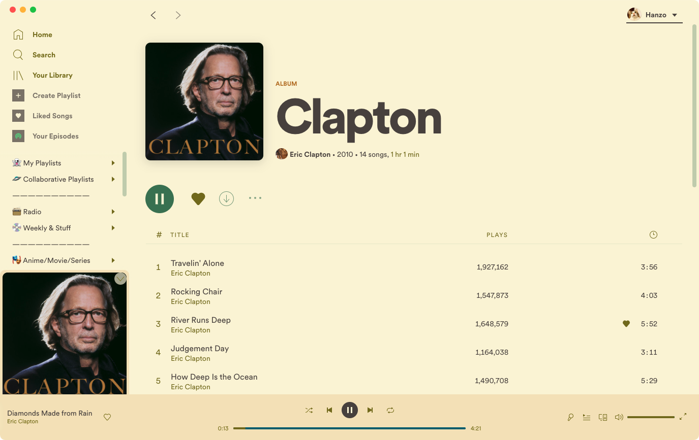
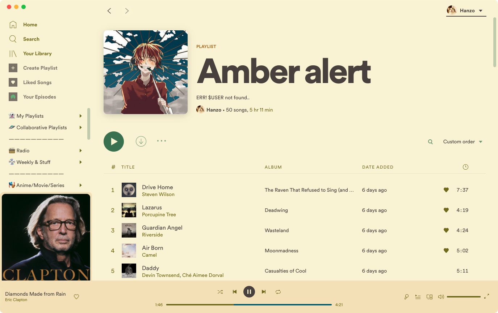

# Onepunch

## Screenshots

#### Dark

|      |      |  |
| :-------------------------------------------: | :---------------------------------------------: | :-----------------------------------------------: |
|                     home                      |                      album                      |                     playlist                      |
|  |  |            |
|                    podcast                    |                     profile                     |                  search (YLX UI)                  |

#### Light

|      |      |  |
| :---------------------------------------------: | :-----------------------------------------------: | :-------------------------------------------------: |
|                      home                       |                       album                       |                      playlist                       |
|  |  |             |
|                     podcast                     |                      profile                      |                  settings (YLX UI)                  |

#### Legacy

|      |
| :---------------------------------------------: |
|                  home (YLX UI)                  |

### Custom Icons


## More

### About

A simple gruvified spotify theme.

### Information

*   To apply this theme:

    ```shell
    # for dark theme
    spicetify config current_theme Onepunch color_scheme dark
    spicetify apply

    #for light theme
    spicetify config current_theme Onepunch color_scheme light
    spicetify apply

    ```

*   Tested on macOS only and pretty much everything worked. ﾍ(･\_|

### Contact

Go **[here](https://github.com/okarin001/Onepunch/issues)** and *check/create* an issue in case you face any problem.
