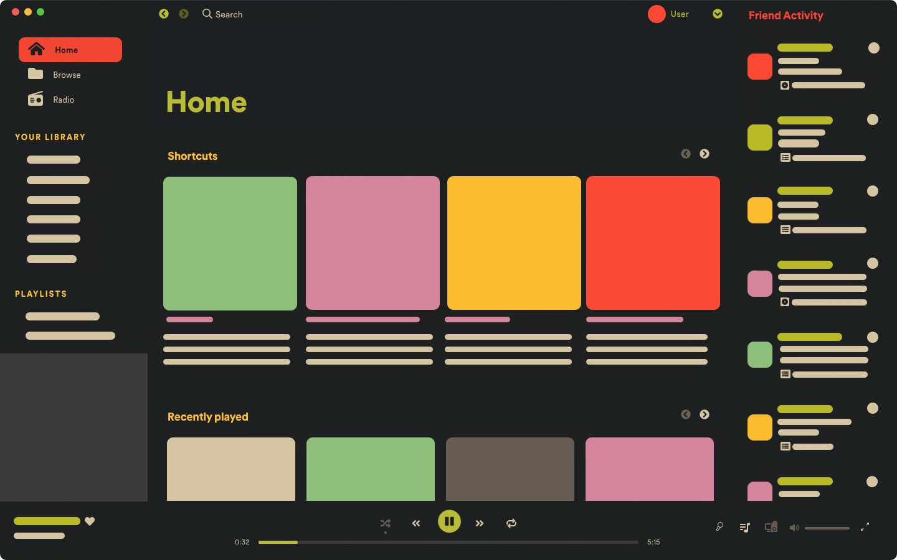
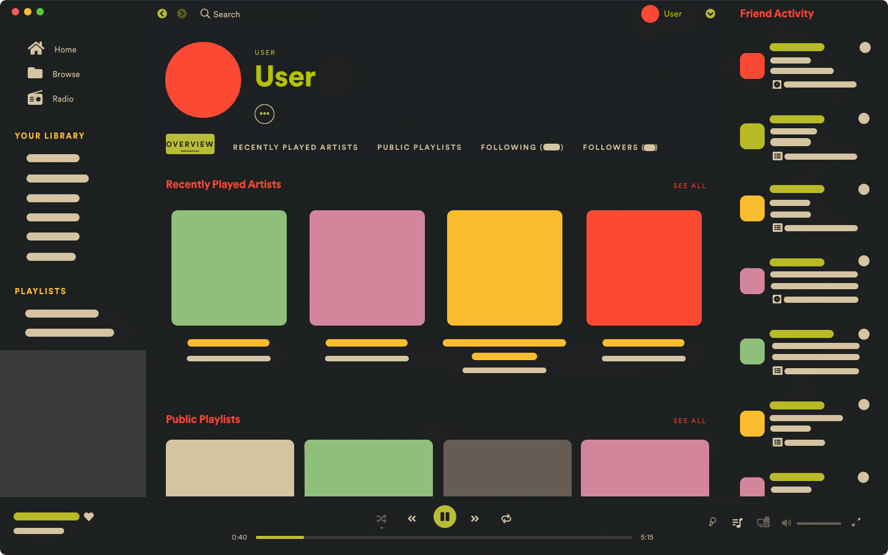
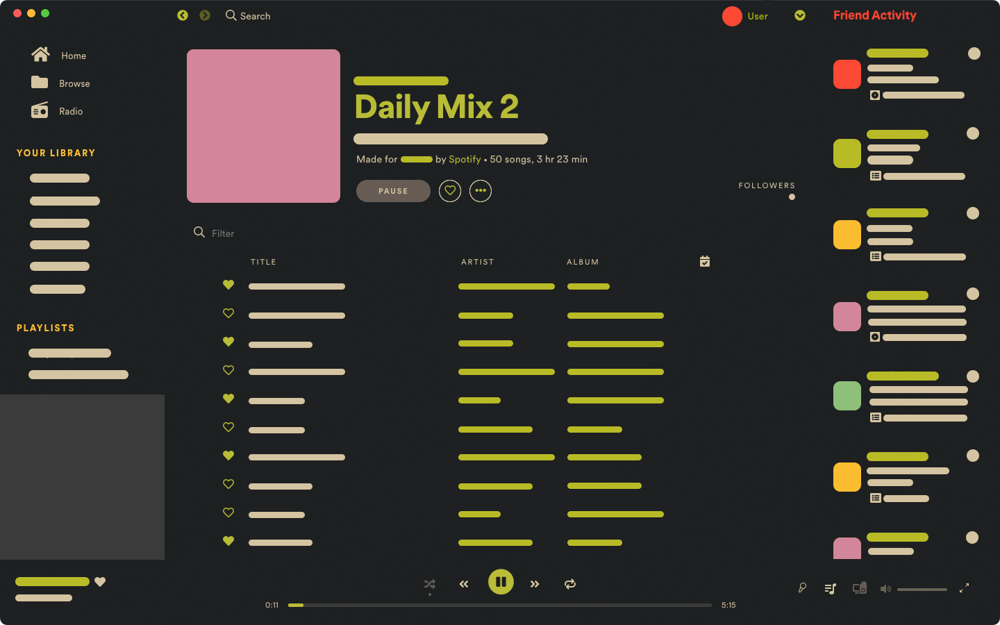

# Onepunch
## Screenshots

## More

#### About
A simple gruvified spotify theme. 

#### First Aid Kit  ¯\\_(ツ)\_/¯

- To change color schemes **`spicetify config color_scheme color_scheme_name`** (change the **`color_scheme_name`** to dark/light)
- Tested on macOS only and pretty much everything worked. ﾍ(･_|

#### On my list
- [x] Gruvified and updated to the new UI.
- [x] Added **dark/light** mode. 
- [x] Almost everything looks fine
- [x] Yeeted the idea of changing icons. 〜〜(／￣▽)／　〜ф
- [ ] Yet to fix some minor color mismatch.

#### Contact
Go **[here](https://github.com/okarin001/Onepunch/issues)** and _check/create_ an issue in case you face any probelm. 
