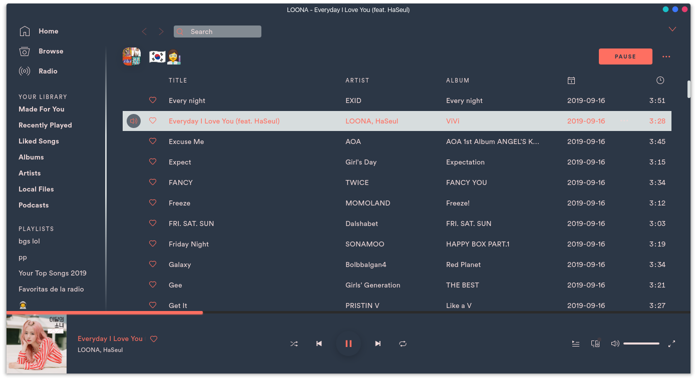
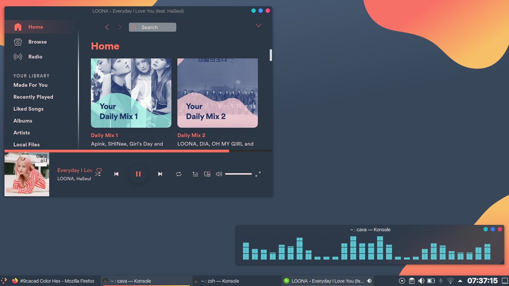

# Otto

### Base

### Honne 

## More

Based on [@jomada](https://github.com/jomada)'s Otto theme for KDE
([Link](https://store.kde.org/p/1358262/) and [Reddit
post](https://www.reddit.com/r/unixporn/comments/flve55/kde_plasma_otto/))

Works best with the Friends tab disabled (Settings > Display Options > disable
"Show Friends Activity")

Honne color scheme based on the Music Artist Honne ◑by HamLord

