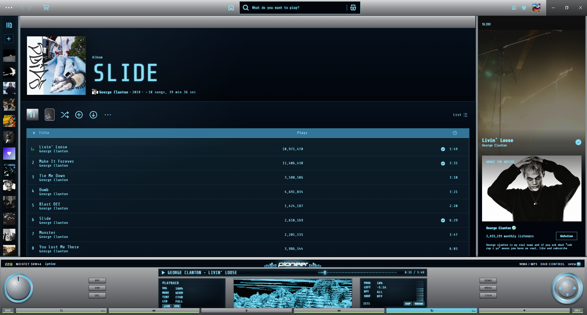
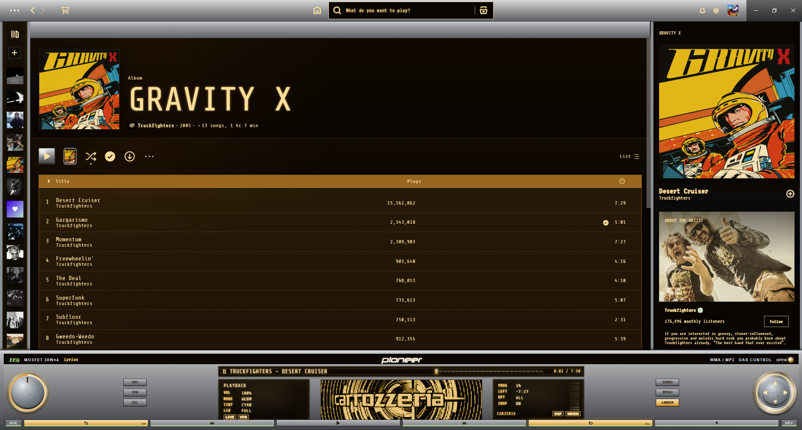
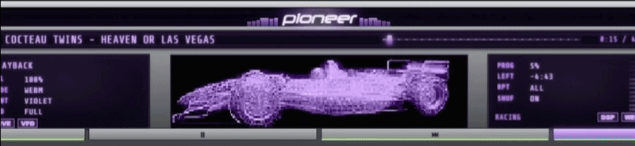

# PioneerVFD

A 2000s Pioneer DEH-P7600MP-style VFD/LCD head-unit theme for Spotify. Replaces the lower
player with a chrome head-unit panel and a center OEL display that plays WebM animation
clips, with RGB display tints (cyan, amber, violet), live audio spectrum bars, and
route-aware app styling.

> Unofficial fan-made theme. Not affiliated with Pioneer Corporation.

## Screenshots







## More

### Setup

The theme requires Spicetify's theme-JS injection so the head-unit runtime, OEL player,
menu, and live audio capture can run:

```
spicetify config current_theme PioneerVFD color_scheme PioneerVFD
spicetify config inject_theme_js 1 expose_apis 1 overwrite_assets 1
spicetify apply
```

### OEL animations

The center OEL/VFD display streams WebM clips on demand from the author's GitHub Pages
host, so the theme folder ships no video assets and works as-is on first install.
Internet is required for animations to play.

### Controls

The Pioneer `MENU` button exposes the runtime controls: `SRC`, `OEL`, `DEMO`, `TINT`,
`TYPE`, `PERF`, `PULSE`, `RACING`, `VFD`, and `DIM`. `PULSE` (Chromium desktop audio
capture for live spectrum bars) is off on launch by design — turn it on from the menu
and pick a capture source that includes audio. `ECO` mode reduces decorative cost on
lower-end machines.

### Fonts

- Neuropol (Ray Larabie) ships in `fonts/` and is auto-loaded via `@font-face`.
- DSEG7Classic is pulled from a public CDN.

### Upstream

Full source and platform installers: https://github.com/adainstarks/PioneerVFD

### Author

[adainstarks](https://github.com/adainstarks) — MIT licensed.
