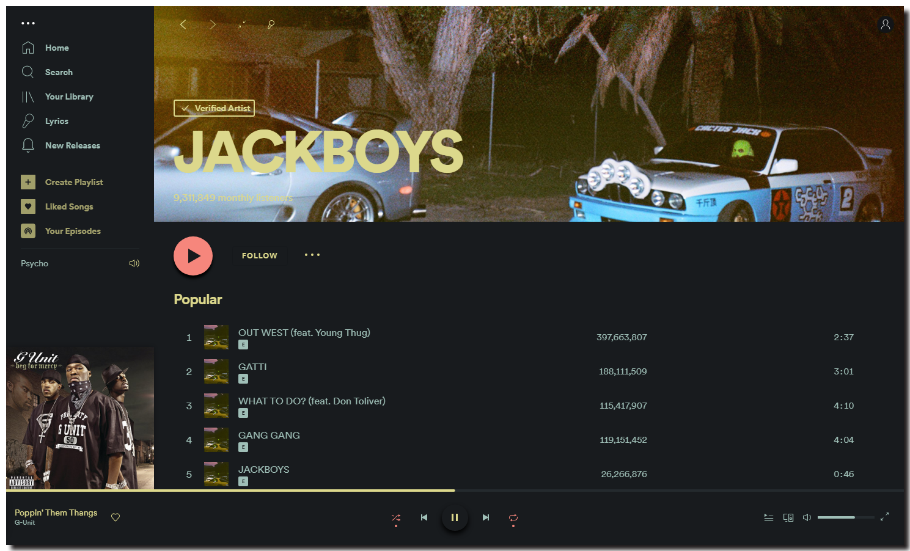
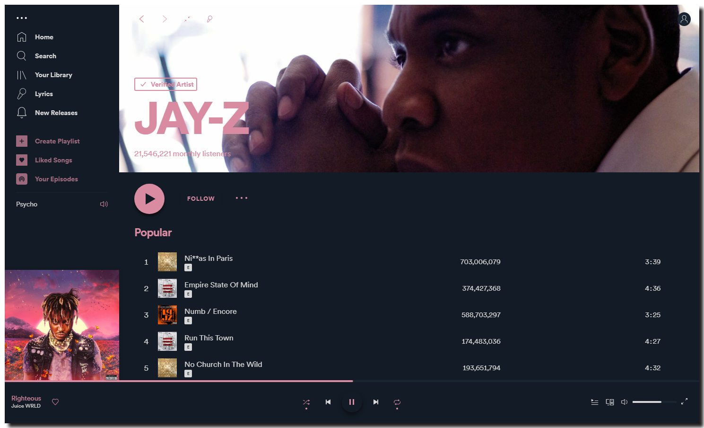
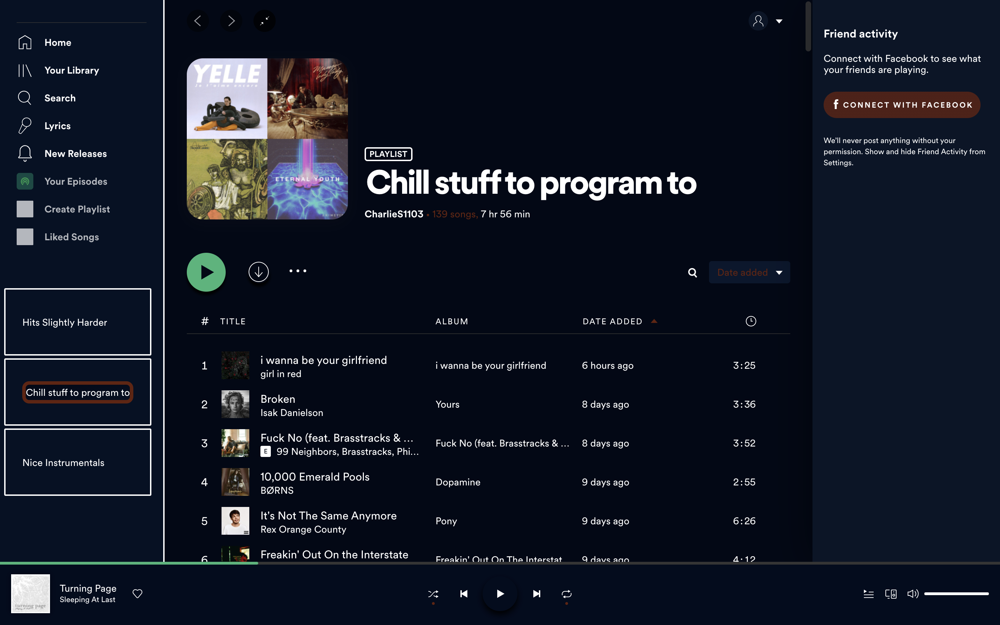
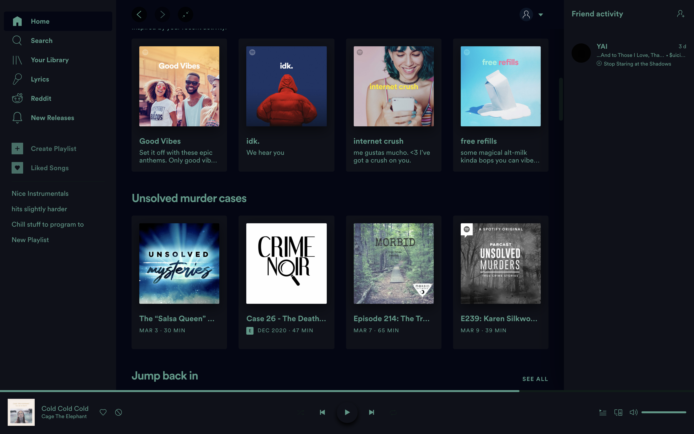
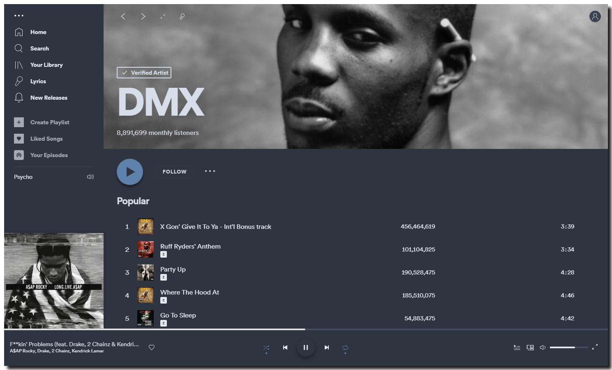
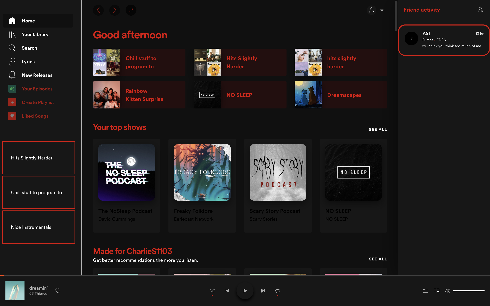

# Sleek

### BladeRunner

### Cherry

### Coral

### Deep

### Deeper

### Elementary

### Futura

### Nord

### Psycho

### UltraBlack

### Wealthy


## Info
A simple, 'sleek' theme that builds upon the basic Spotify UI to create a more stylised experience. Also removes all annoyances from free version, including banner advertisements and upgrade buttons.

Created by [@harbassan](https://github.com/harbassan)

### Changing Color Schemes
Change the scheme with these commands:
```
spicetify config color_scheme <scheme name>
spicetify apply
```