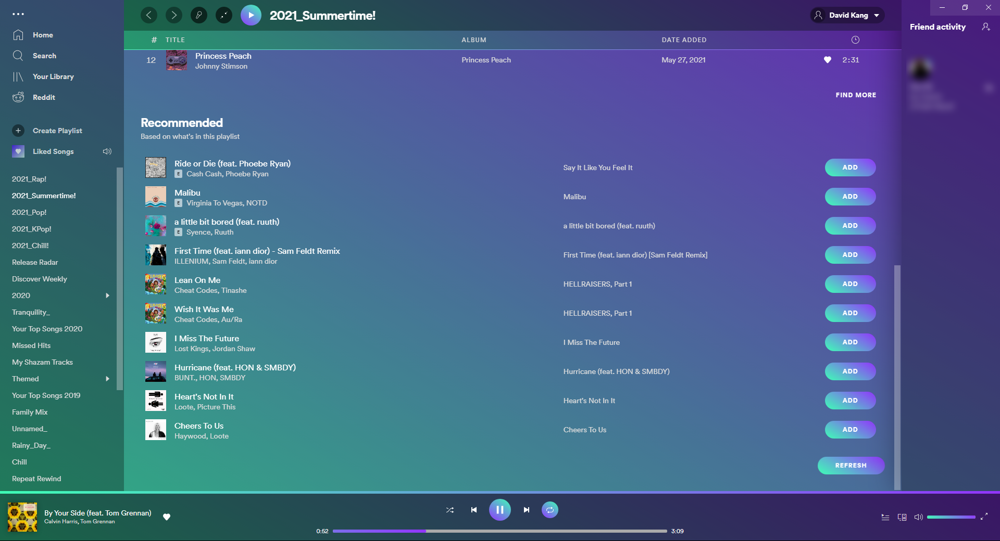

# Spectra

## Screenshots

#### About

Spectra Theme for Spicetify CLI,
Made from the ground up.
JavaScript not included.™

### Installation

To install this theme, go to your spicetify's theme folder,
(Which can be viewed by running the command **`spicetify`**)
and **`git clone https://github.com/hahagu/SpicetifySpectra.git`** from the themes directory.

Then, you can run **`spicetify config current_theme Spectra`** and **`spicetify apply`** to apply the theme.

#### Directions

-   To change color schemes, use the command **`spicetify config color_scheme theme_name`** .
-   Available color schemes are listed in the [color.ini](./color.ini) file.
-   You can create your own schemes following the same structure from the [color.ini](./color.ini) file.
