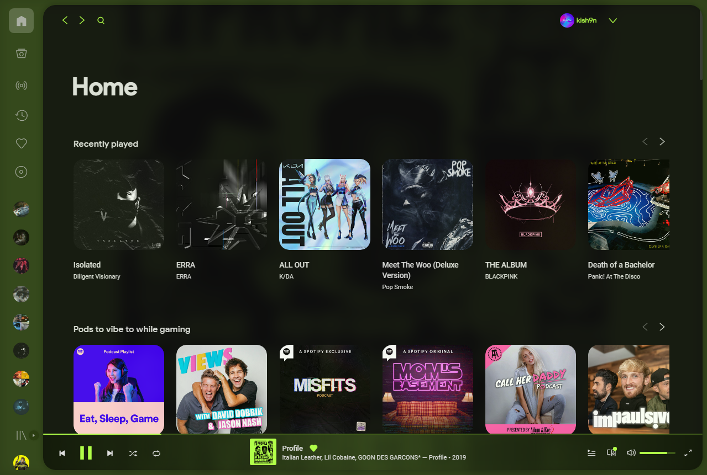
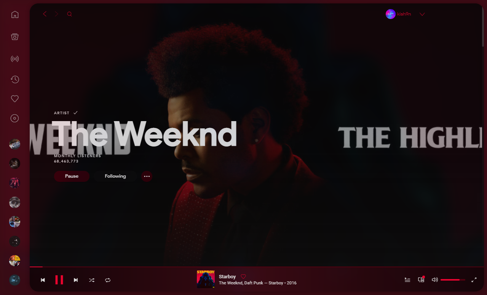

# SubtleDribbblishDynamic
A modified version of Spicetify's DribbblishDynamic theme

## Screenshots




## About
Spicetify is a third-party addition to Spotify's desktop client that unlocks a wide variety of features, one being themes. SubtleDribbblishDynamic is based off of Spicetify's DribbblishDynamic theme, one of their included themes. SubtleDribbblishDynamic aims to 'turn down' DribbblishDynamic's colors and make the client a little more...*subtle*. 

## Requirements
- [Spotify Desktop](https://www.spotify.com/us/download/windows/) - Must be downloaded and installed from their website. Incompatible with the Windows Store version of Spotify
- [Spicetify CLI](https://github.com/khanhas/spicetify-cli) - Follow instructions for installation
- [DribblishDynamic](https://github.com/morpheusthewhite/spicetify-themes/tree/master/DribbblishDynamic) - The main theme this project is based upon
- users.css - File is included in this repo

## Instalation
1. Install [Spotify Desktop](https://www.spotify.com/us/download/windows/)
2. Install [Spicetify CLI](https://github.com/khanhas/spicetify-cli)
3. Install [DribblishDynamic](https://github.com/morpheusthewhite/spicetify-themes/tree/master/DribbblishDynamic)
4. Replace user.css in ```.spicetify\Themes\DribbblishDynamic\``` with the css file above in DribbblishDynamic's file location
5. Apply changes with ```spicetify apply``` in theme folder

## Credits
- [@khanhas](https://github.com/khanhas) - Spicetify CLI and the original Dribblish theme
- [@JulienMaille](https://github.com/JulienMaille) - DribblishDynamic theme