# Themes preview

Here you can find a preview of all the themes. Some of them may have different colour schemes (in that case you'll find different entries in the same theme, each one named after the colour scheme).

## Adapta-Nokto

## Arc-Dark

#### Base

#### Aritim-Dark

## Arc-Green

## BIB-Green

## Bittersweet

## Black

#### Base

#### Purple

## BladeRunner

#### Base

#### 2049

## Blueballs

## BurntSienna

## Challenger-Deep

## Cherry

## DanDrumStoneNew

## Dark

#### Base

#### Bloody

## DeepCoral

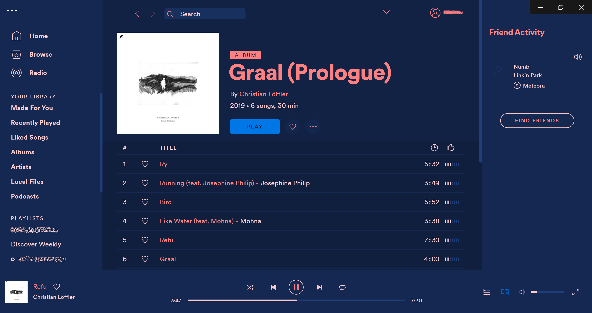

## Discord

## Dobbo

## Dracula

## Dribbblish

#### Base

#### Beach-Sunset

#### Dark

#### Dracula

#### Dracula2

#### Gruvbox

#### Horizon

#### Nord-Dark

#### Nord-Light

#### Purple

#### Samouraï

#### Wal

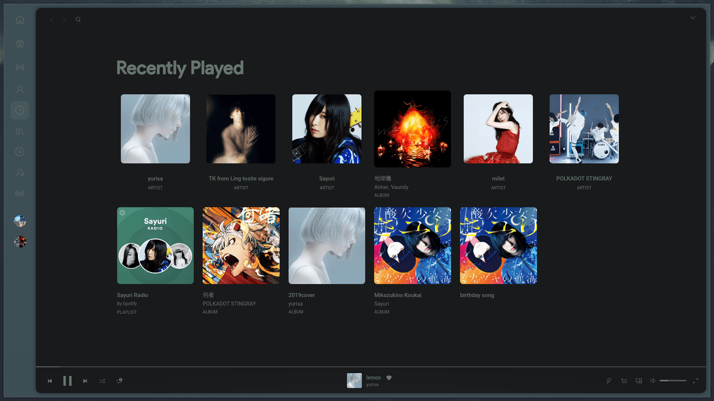

#### White

## DribbblishDynamic

#### Dark

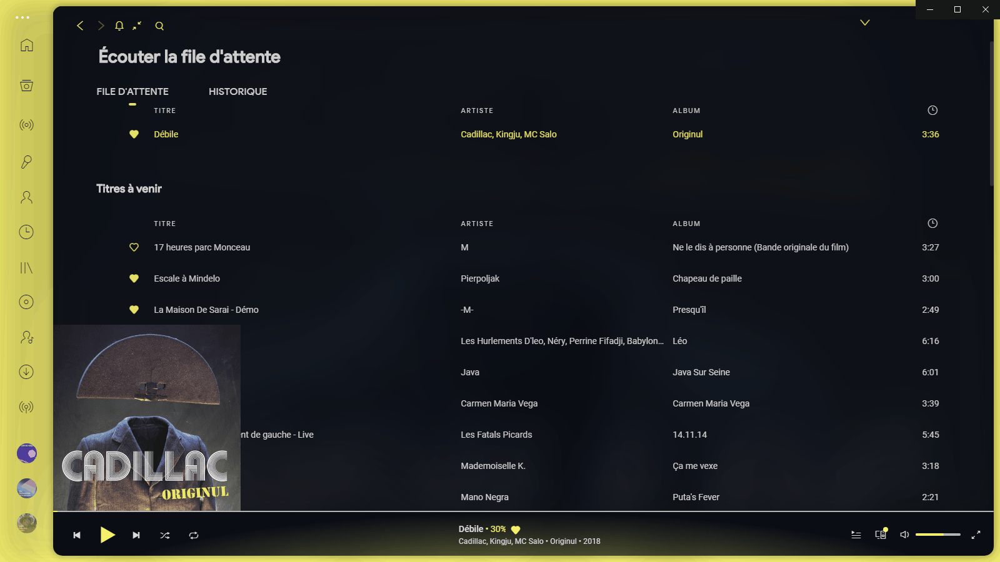

#### White

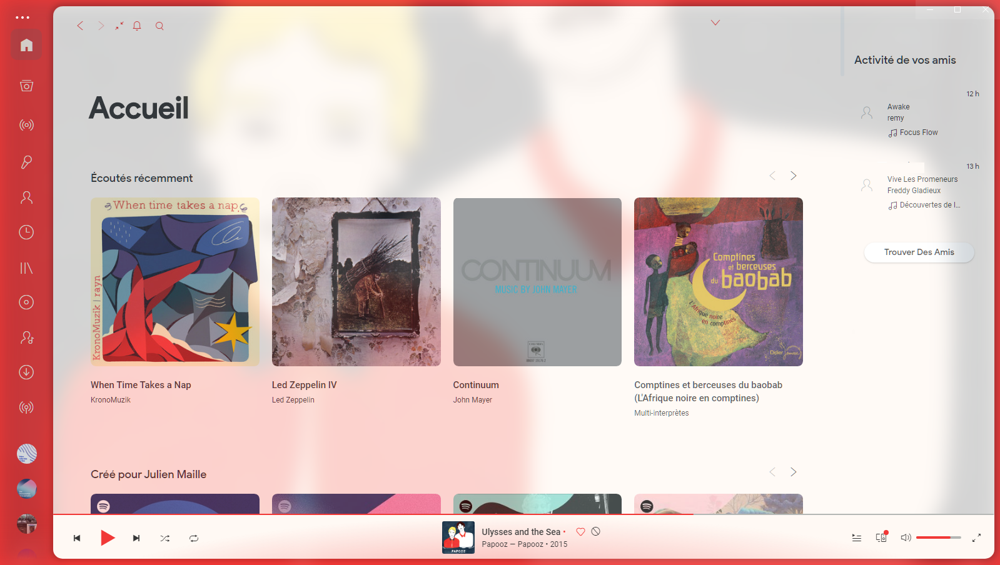

## Elementary

#### Base

#### BlueContrast

#### Nightcity

## Flatten

## Gradianto

## Gruvbox-Gold

## JarvisBot

#### Base

#### CherryBlossom

#### Coral

#### DanDrumStone

## Kaapi

#### Base

#### Gruvbox

## Koushi

#### Light

#### Dark

## Matcha

#### Base

#### Light

#### Dark-Aliz

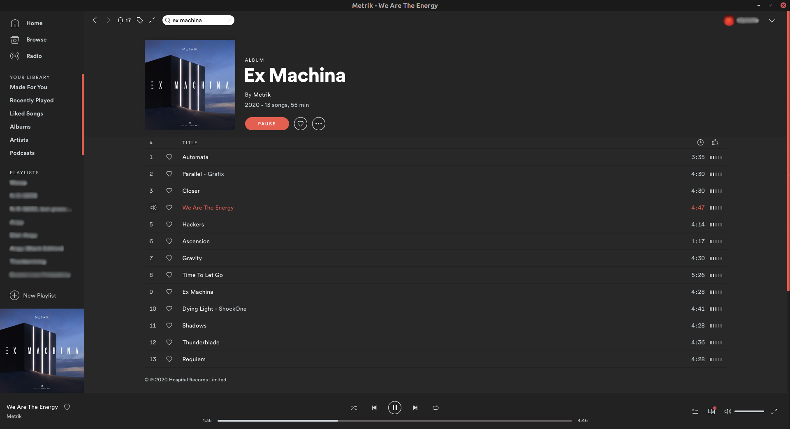

## Material-Ocean

## Midnight-Light

## MoonChild

## Night-Owl

## Night

## NightMoon

## Nord

## NoSleep

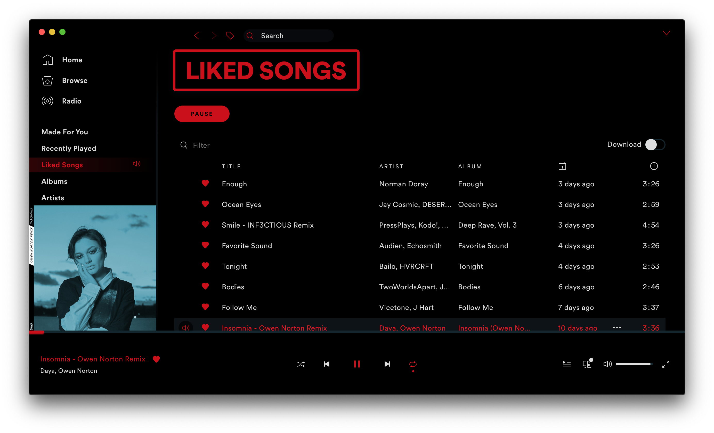

## OneDarkish

#### Base

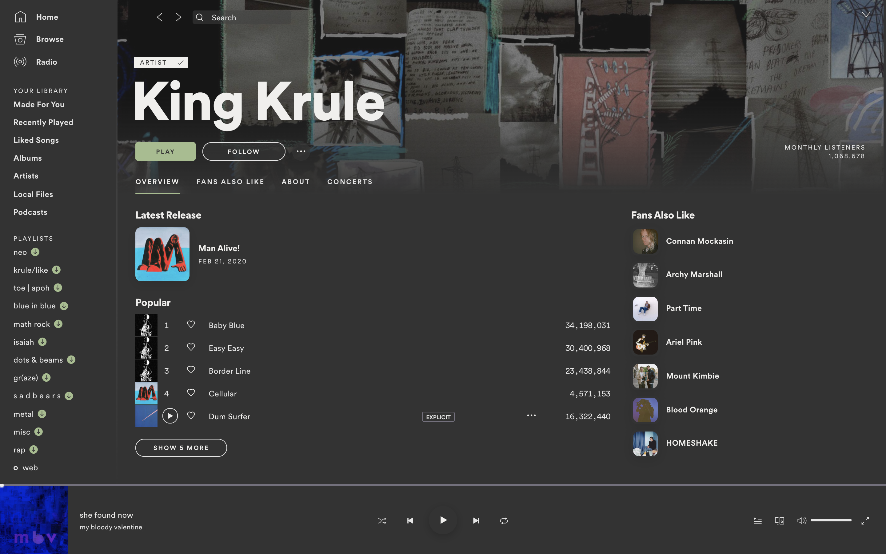

#### VPFut

#### Discord

## Onepunch

## Otto

#### Base

#### Honne

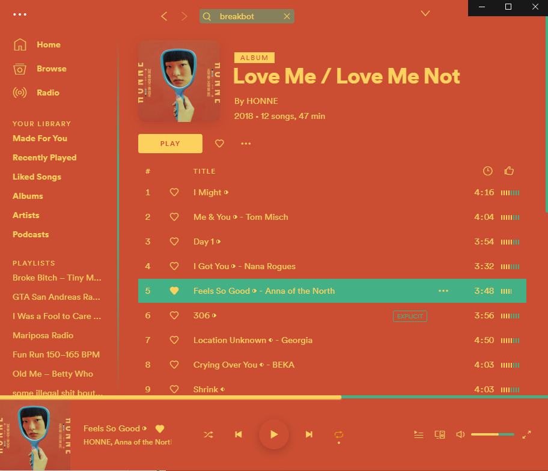

## OutrunDark

## OldSchoolSenn

## Phosphoria

## Pop-Dark

## ShadowCustom

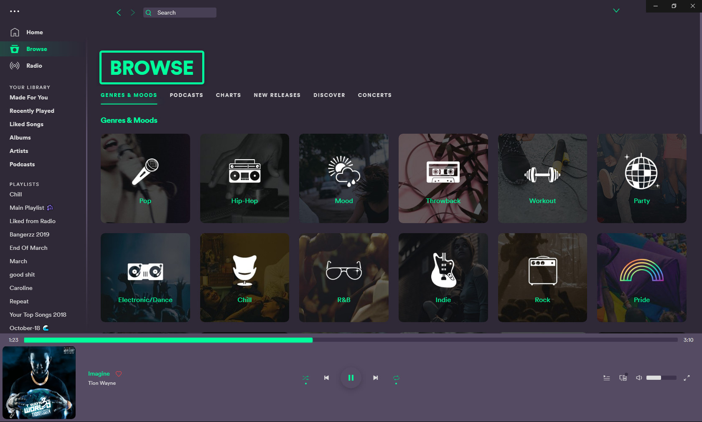

## Twasi

## SolarizedDark

## Spicy

## Sweet

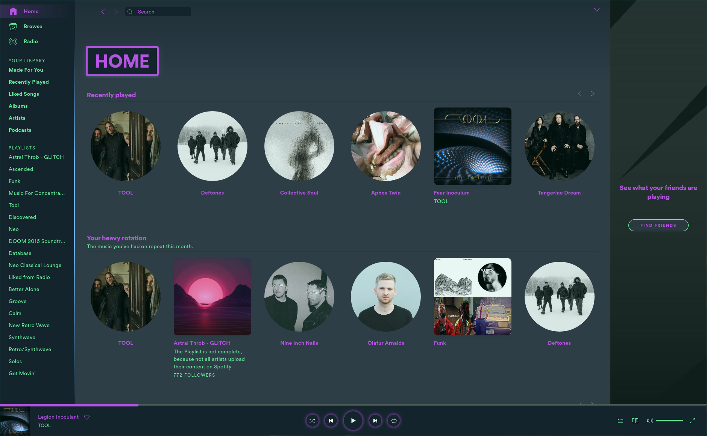

## Tidal

## TrekyGoldenrod

## TychoAwake

#### Base

#### Lovelace

#### Lovepink

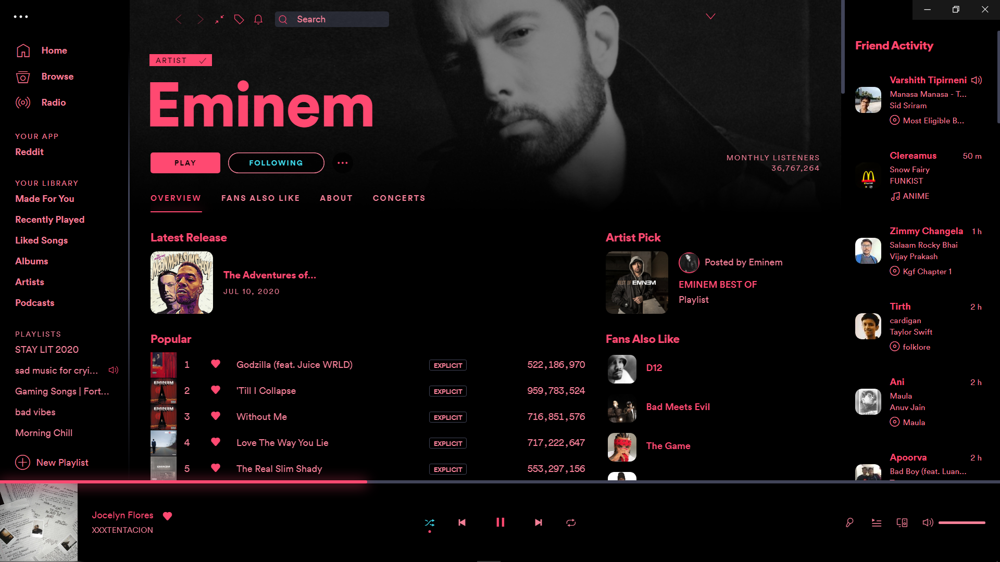

#### Mint

#### Neon

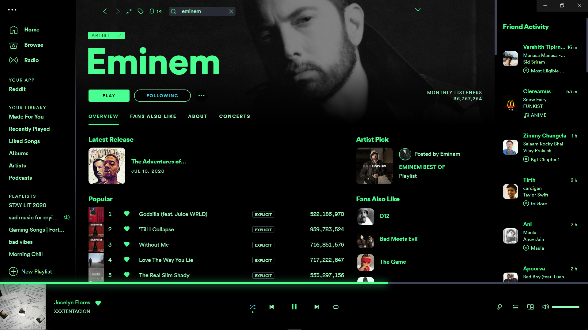

## Turntable

## Vaporwave

#### NewRetro

#### Samurai

#### SeaPunk

#### Tree-Green

## WintergatanBlueprint

## YoutubeDark

