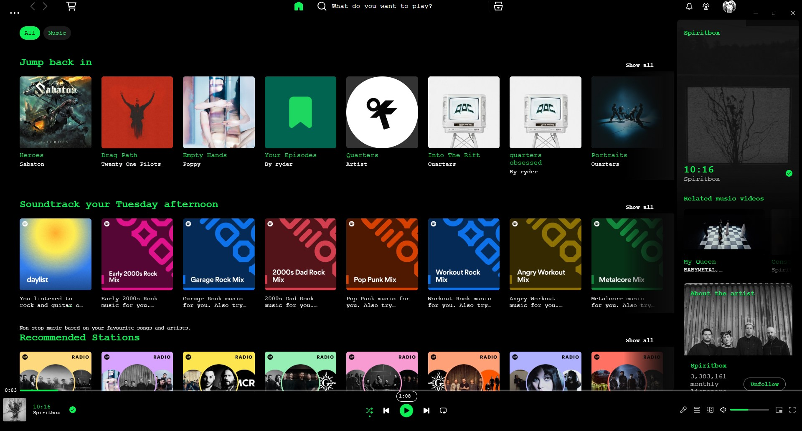

# Typewriter

Terminal theme is a simple black with green / white text styling, with a dynamic left sidebar and the playbar moved. The styling is based on the "Old school" theme from Focuswriter. This theme may later be updated to add the other stylings used on Focuswriter.

View the **CHANGELOG** [here](tba)

## Screenshots

### Base

  

## More

### Font Usage

- Font used is Courier New and should work without any additional downloads. If not, it's this one on Adobe [here](https://fonts.adobe.com/fonts/courier-new).

### Created by

- https://github.com/rydooper

### Additional Credits

- Theming originally from Focuswriter by Gottcode which can be found [here](https://gottcode.org/focuswriter/)
- Code snippets used can be found in the Marketplace and are as follows: 
    - Dynamic left sidebar
    - Hide Made for You
    - Hide Recently played
    - Hide audiobooks and podcasts (on Home page)
    - Hide background gradient on home page
- Additional code snippet from the "Dreary" theme that changes the playback bar location - theme found on the Marketplace / [here](https://github.com/spicetify/spicetify-themes/tree/master/Dreary)

### Credits

>  Permission is hereby granted, free of charge, to any person obtaining a copy of this software and associated documentation files (the "Software"), to deal in the Software without restriction, including without limitation the rights to use, copy, modify, merge, publish, distribute, sublicense, and/or sell copies of the Software, and to permit persons to whom the Software is furnished to do so, subject to the following conditions:

>  The above copyright notice and this permission notice shall be included in all copies or substantial portions of the Software.

>  THE SOFTWARE IS PROVIDED "AS IS", WITHOUT WARRANTY OF ANY KIND, EXPRESS OR IMPLIED, INCLUDING BUT NOT LIMITED TO THE WARRANTIES OF MERCHANTABILITY, FITNESS FOR A PARTICULAR PURPOSE AND NONINFRINGEMENT. IN NO EVENT SHALL THE AUTHORS OR COPYRIGHT HOLDERS BE LIABLE FOR ANY CLAIM, DAMAGES OR OTHER LIABILITY, WHETHER IN AN ACTION OF CONTRACT, TORT OR OTHERWISE, ARISING FROM, OUT OF OR IN CONNECTION WITH THE SOFTWARE OR THE USE OR OTHER DEALINGS IN THE SOFTWARE.