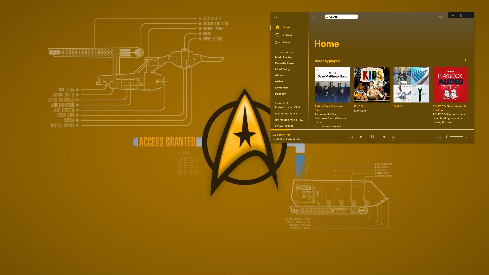
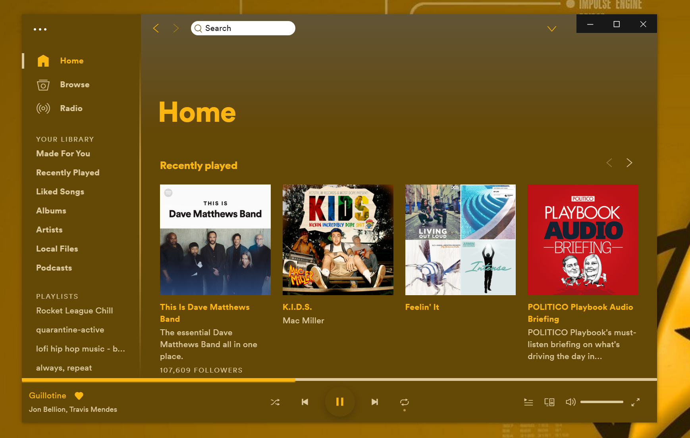

# TrekyGoldenrod

## Screenshots

## More

**Credits**: Based off the [Sweet](https://github.com/morpheusthewhite/spicetify-themes/tree/master/Sweet) theme developed by [morpheusthewhite](https://github.com/morpheusthewhite) 

### To Do

- [ ] Get rid of Followers number on public playlists
- [ ] Change font
- [ ] Deal with awkward `profile-menu-toggle` arrow at top right of app
- [ ] Is it possible to match color for min, max, and close buttons at top right of app