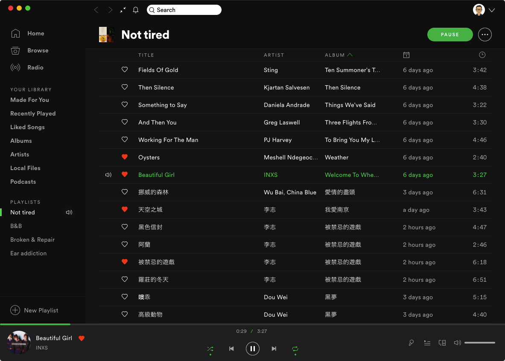
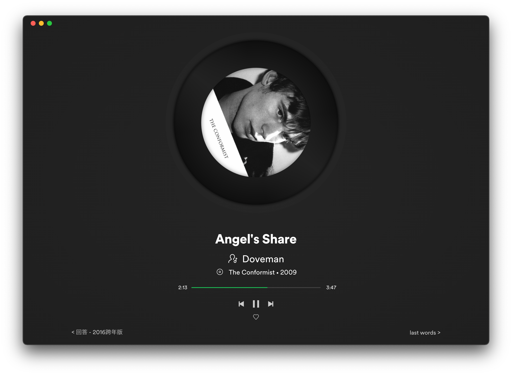

# Turntable

Based on Spotify original theme.

**Note:** Require Spicetify **v2.2.0** or higher! Otherwise, performance problems will happen when the turntable rotate!

View the **CHANGELOG** [here](https://github.com/grasonchan/spotify-spice/blob/master/CHANGELOG.md).

## Screenshots

<div align="center">
  
</div>
<div align="center">
  
</div>
<div align="center">
  
</div>

## More

### About Turntable

Use CSS to achieve, not picture. This means it can be scaled to any size, but make sure the album cover is not blurry.

Actually, the rotation of the turntable was created at spicetify v1, but in some cases, animation is affected by other factors. I think "fullAppDisplay.js high GPU usage" is the reason. Fortunately, it's normal now!

### Info

Designed and developed by [Grason Chan](https://github.com/grasonchan).

The turntable inspired by [Netease Music](https://music.163.com) and [Smartisan OS build-in Music Player](https://www.smartisan.com/os/#/beauty) (not include code).

Develop and test on macOS. If there's any problem, please open issue or PR.

### Installation

1. add extension - [Full App Display](https://spicetify.app/docs/getting-started/extensions#full-app-display)

```shell
spicetify config extensions fullAppDisplay.js
spicetify apply
```

2. put **Turntable** and **turntable.js** into the **.config/spicetify**

```shell
cd spicetify-themes
cp -r Turntable ~/.config/spicetify/Themes
cp Turntable/turntable.js ~/.config/spicetify/Extensions
```

3. select the theme and extension, then apply

```shell
spicetify config current_theme Turntable
spicetify config extensions turntable.js
spicetify apply
```

### How to Uninstall

1. remove **Turntable** and **rotateTurntable.js**

```shell
rm -r ~/.config/spicetify/Themes/Turntable
rm ~/.config/spicetify/Extensions/turntable.js
```

2. config to spicetify default theme

```shell
spicetify config current_theme SpicetifyDefault
```

3. remove extension - Full App Display and Turntable(optional)

```shell
spicetify config extensions fullAppDisplay.js-
spicetify config extensions turntable.js-
```

4. apply

```shell
spicetify apply
```
