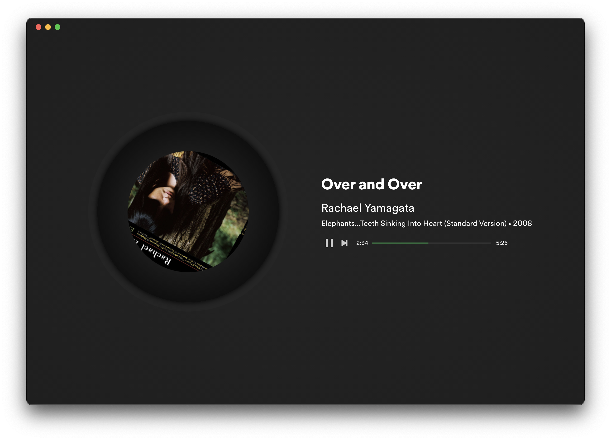

# Turntable

Based on Spotify original theme.

A new version for spicetify v2 click [here](https://github.com/grasonchan/spotify-spice).

## Screenshots

<div align="center">
  
</div>
<div align="center">
  
</div>

## More

### Info

Designed and developed by [Grason Chan](https://github.com/grasonchan).

The turntable inspired by [网易云音乐](https://music.163.com) and [Smartisan OS build-in Music Player](https://www.smartisan.com/os/#/beauty) (not include code).

### Installation

1. add extension - [Full App Display](https://github.com/khanhas/spicetify-cli/wiki/Extensions#full-app-display)

```bash
spicetify config extensions fullAppDisplay.js
```

2. select the theme and apply

```bash
spicetify config current_theme Turntable
spicetify apply
```
