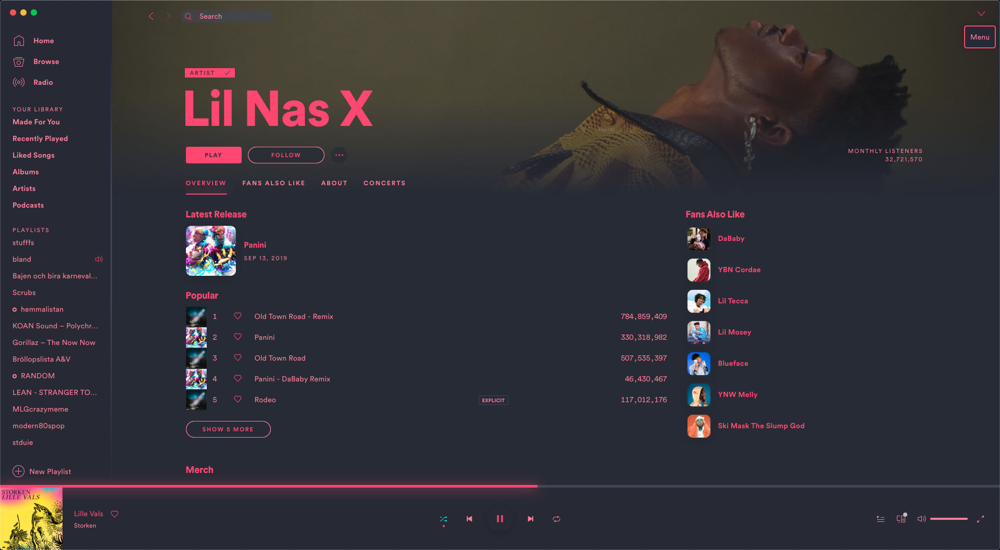
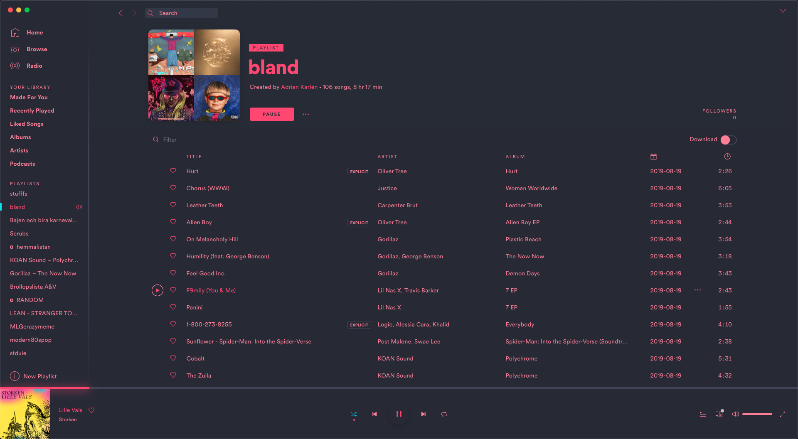
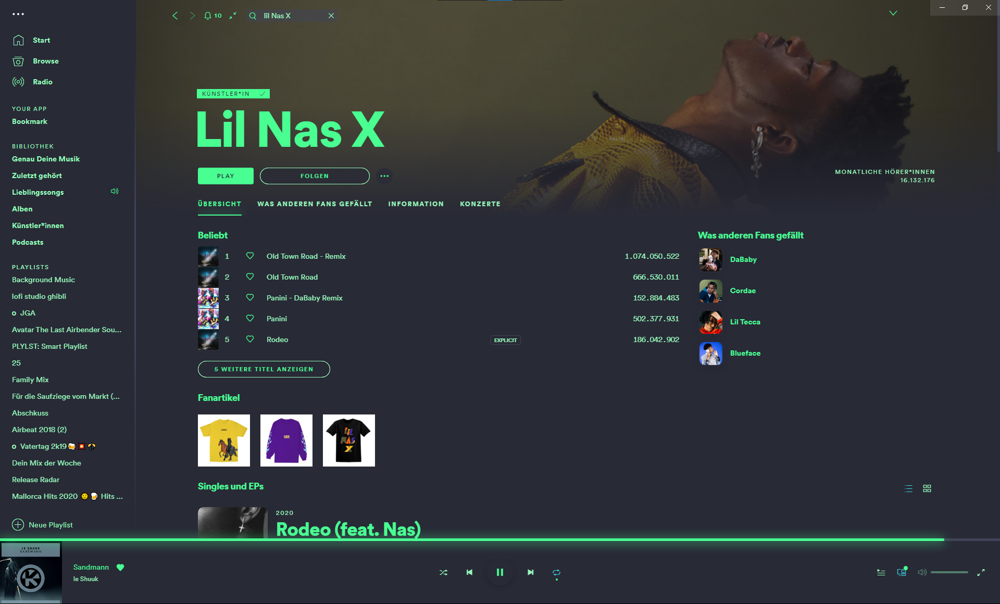
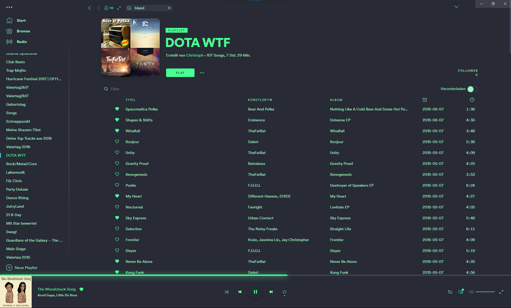

# TychoAwake

### Base

### Lovelace

### Lovepink

### Mint

### Neon

## More

Source: https://github.com/DoubleJarvis/SpicetifyThemes

Author of Lovelace color scheme: [adriankarlen](https://github.com/adriankarlen) Neon dark themes provided by [bBSempai](https://github.com/bbsempai)

Based on [this](https://raw.githubusercontent.com/mbadolato/iTerm2-Color-Schemes/master/schemes/lovelace.itermcolors) iTerm2 color scheme.

