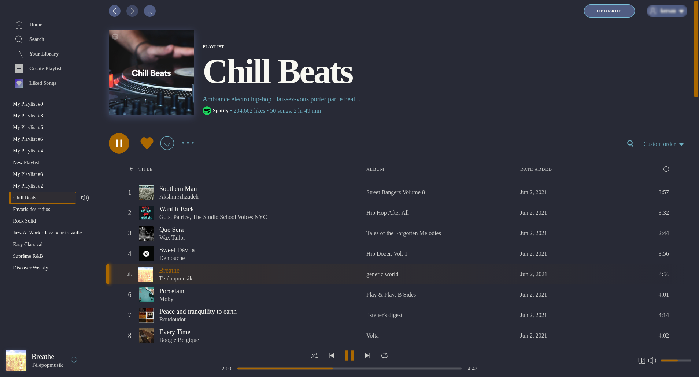
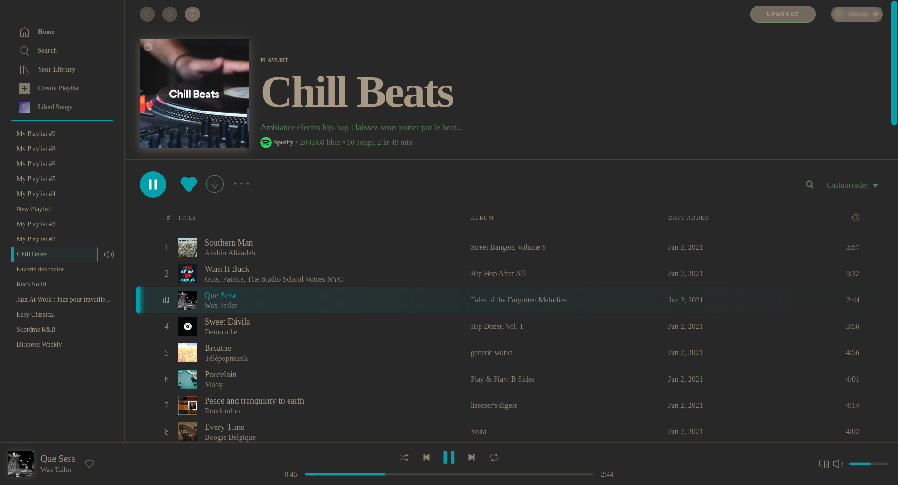
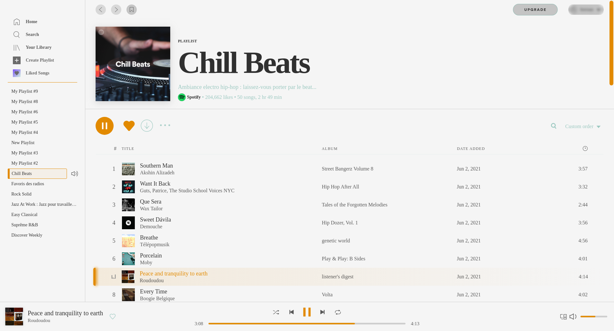
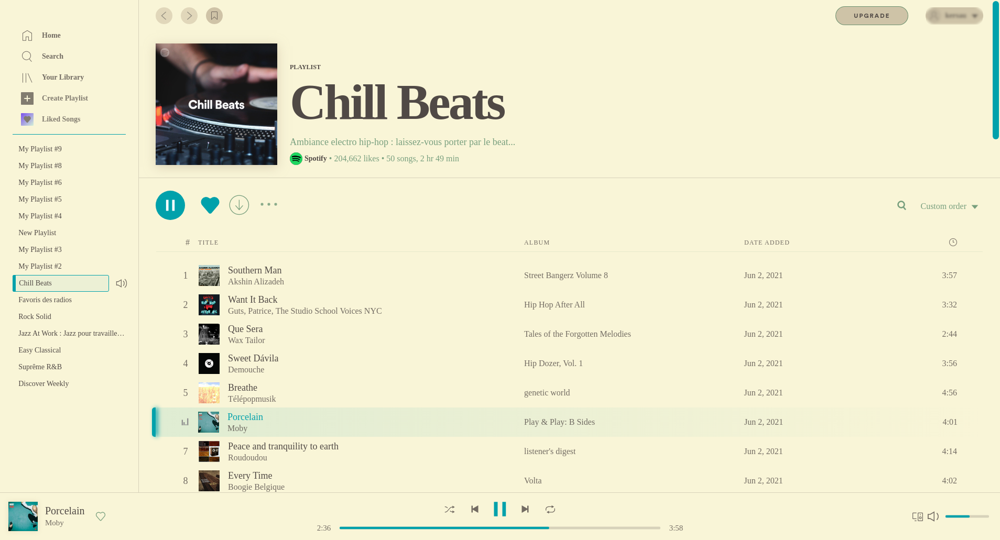

# Xresources

A [Spicetify](https://github.com/khanhas/spicetify-cli) theme which follow Xresources colors.

## Screenshots
### dark color schemes examples
| | |
| - | - |
| dracula color scheme, accent color orange | gruvbox color scheme, accent color blue |
|  |  |

### light color schemes examples
| | |
| - | - |
| base16_classic color scheme, accent color orange | gruvbox-mdium color scheme, accent color blue |
|  |  |

## More
Built on top of [BurntSienna](https://github.com/devcroc/spicetify-themes/tree/master/BurntSienna) as base theme (using Montserrat font)

Follow colors definitions from Xresources + an accent color.

> Colors definitions are exclusively based on Xresources colors. This mean no color_scheme definition is necessary in spicetify config. Either light or dark, the theme should follow nicely your defined color scheme with Xresources (see examples).
>
> You just need to adjust the `accent` color in `color.ini`.

>Even if not necessary, there are a `dark` and `light` color scheme definition which only serve the purpose as fallback values in case no colors are retrieved from Xresources. Obviously, this seems quite pointless as if you want to use this theme, you have Xresources colors defined !  

## Enable
to use it :
```bash
spicetify config current_theme Xresources
spicetify apply
```

Author : [devcroc](https://github.com/devcroc)